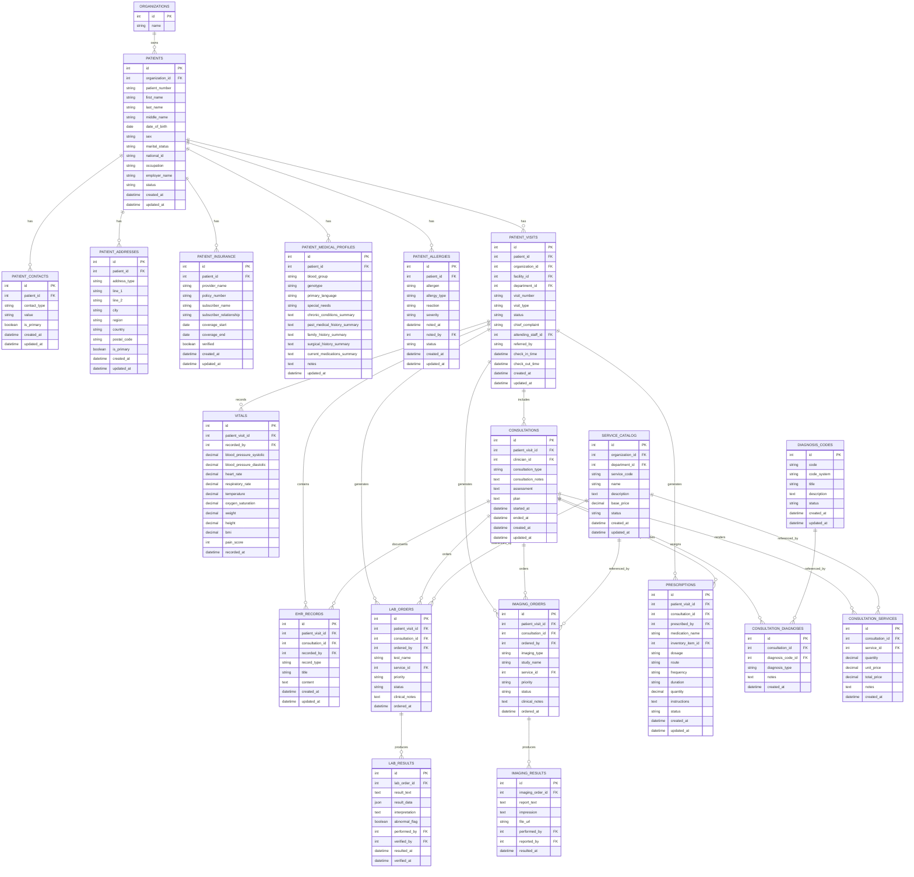
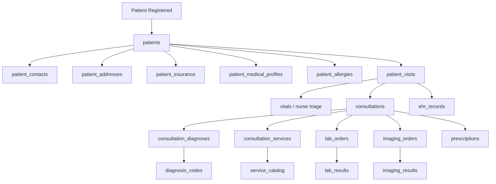

# Patient & Clinical Workflow Schema Documentation

## Overview

This section defines the **patient domain** and the **clinical workflow domain** for the organizational health management system.

The design goal is to separate:

* long-lived patient identity data
* patient contact and insurance data
* baseline medical summary data
* visit-specific clinical workflow data
* doctor consultation data
* diagnoses
* services rendered
* lab and imaging orders/results
* prescriptions

This separation keeps the schema clear, avoids overloading a single table, and makes the system easier to adapt across different organizations and facilities.

---

## Design Principles

### 1. Separate baseline patient data from visit data

A patient exists across time, but consultations, vitals, lab orders, and prescriptions happen during a specific visit.

### 2. Use `patient_visits` as the encounter anchor

Most clinical workflow records should attach to a visit, not directly to the patient.

### 3. Separate diagnosis from services rendered

Diagnosis codes describe conditions. Services represent actions performed and may later connect to billing.

### 4. Keep clinically important structured data separate

For example, allergies should not be buried only inside a note or summary field if they need to be queried and highlighted during care.

---

# Table Definitions

## 1. `patients`

### What it stores

The long-lived identity and demographic record for a patient.

This table represents the patient as a person in the system and should not contain visit-specific data.

### Fields

| Field             | Description                                               |
| ----------------- | --------------------------------------------------------- |
| `id`              | Unique identifier for the patient                         |
| `organization_id` | Organization the patient record belongs to                |
| `patient_number`  | Internal patient identifier used by the organization      |
| `first_name`      | Patient’s first name                                      |
| `last_name`       | Patient’s last name                                       |
| `middle_name`     | Optional middle name                                      |
| `date_of_birth`   | Patient’s date of birth                                   |
| `sex`             | Sex recorded for the patient                              |
| `marital_status`  | Marital status                                            |
| `national_id`     | Optional government or national ID                        |
| `occupation`      | Patient’s occupation                                      |
| `employer_name`   | Optional employer information                             |
| `status`          | Record status such as `active`, `inactive`, or `deceased` |
| `created_at`      | Timestamp when the record was created                     |
| `updated_at`      | Timestamp when the record was last updated                |

---

## 2. `patient_contacts`

### What it stores

Contact methods for a patient such as phone numbers and email addresses.

This supports multiple contact methods per patient.

Consent does not belong in this table.
This table stores how a patient can be reached.
Consent should live in dedicated consent-history and current-consent tables and may reference `patient_contacts.id` when the permission is specific to one phone number or email.

### Fields

| Field          | Description                                          |
| -------------- | ---------------------------------------------------- |
| `id`           | Unique identifier for the contact record             |
| `patient_id`   | Patient the contact belongs to                       |
| `contact_type` | Type such as `phone` or `email`                      |
| `value`        | The actual contact value                             |
| `is_primary`   | Indicates whether this is the primary contact method |
| `created_at`   | Timestamp when the contact was created               |
| `updated_at`   | Timestamp when the contact was last updated          |

### Important note

Do not add outreach permission flags such as voice or SMS opt-in directly to `patient_contacts`.
Those flags change over time, need audit history, and may differ by purpose or workflow.
Use consent tables for permission truth and link back to `patient_contacts` when needed.

---

## 3. `patient_addresses`

### What it stores

Addresses associated with the patient.

A patient may have more than one address, such as home and work.

### Fields

| Field          | Description                                   |
| -------------- | --------------------------------------------- |
| `id`           | Unique identifier for the address record      |
| `patient_id`   | Patient the address belongs to                |
| `address_type` | Type such as `home`, `work`, or `other`       |
| `line_1`       | Main address line                             |
| `line_2`       | Secondary address line                        |
| `city`         | City or town                                  |
| `region`       | Region or state                               |
| `country`      | Country                                       |
| `postal_code`  | Postal or ZIP code                            |
| `is_primary`   | Indicates whether this is the primary address |
| `created_at`   | Timestamp when the address was created        |
| `updated_at`   | Timestamp when the address was last updated   |

---

## 4. `patient_insurance`

### What it stores

Insurance details associated with a patient.

This can support one or more insurance records depending on business rules.

### Fields

| Field                     | Description                                                  |
| ------------------------- | ------------------------------------------------------------ |
| `id`                      | Unique identifier for the insurance record                   |
| `patient_id`              | Patient the insurance belongs to                             |
| `provider_name`           | Insurance provider name                                      |
| `policy_number`           | Policy or membership number                                  |
| `subscriber_name`         | Name of the primary subscriber if different from the patient |
| `subscriber_relationship` | Relationship of patient to subscriber                        |
| `coverage_start`          | Coverage start date                                          |
| `coverage_end`            | Coverage end date                                            |
| `verified`                | Whether the insurance has been verified                      |
| `created_at`              | Timestamp when the insurance record was created              |
| `updated_at`              | Timestamp when the insurance record was last updated         |

---

## 5. `patient_medical_profiles`

### What it stores

The patient’s baseline clinical summary that is not tied to one specific visit.

This table is meant for standing summary information clinicians may want to see across encounters.

### Fields

| Field                          | Description                                  |
| ------------------------------ | -------------------------------------------- |
| `id`                           | Unique identifier for the medical profile    |
| `patient_id`                   | Patient this profile belongs to              |
| `blood_group`                  | Patient blood group                          |
| `genotype`                     | Patient genotype if used by the organization |
| `primary_language`             | Preferred language                           |
| `special_needs`                | Accessibility or special care needs          |
| `chronic_conditions_summary`   | Summary of chronic conditions                |
| `past_medical_history_summary` | Summary of prior medical history             |
| `family_history_summary`       | Summary of relevant family history           |
| `surgical_history_summary`     | Summary of past surgeries                    |
| `current_medications_summary`  | Summary of long-term medications             |
| `notes`                        | Additional general notes                     |
| `updated_at`                   | Timestamp when the profile was last updated  |

### Important note

This is not the main home for allergies, consultation notes, lab results, or prescriptions.

---

## 6. `patient_allergies`

### What it stores

Structured allergy records for a patient.

This is separated from the general medical profile so allergies can be clearly queried and highlighted in clinical workflows.

### Fields

| Field          | Description                                              |
| -------------- | -------------------------------------------------------- |
| `id`           | Unique identifier for the allergy record                 |
| `patient_id`   | Patient the allergy belongs to                           |
| `allergen`     | Substance causing the allergy                            |
| `allergy_type` | Type such as `drug`, `food`, `environmental`, or `other` |
| `reaction`     | Observed or reported reaction                            |
| `severity`     | Severity level                                           |
| `noted_at`     | Date/time the allergy was recorded                       |
| `noted_by`     | User or clinician who recorded it                        |
| `status`       | Status such as `active`, `inactive`, or `resolved`       |
| `created_at`   | Timestamp when the allergy record was created            |
| `updated_at`   | Timestamp when the allergy record was last updated       |

---

## 7. `patient_visits`

### What it stores

A single encounter or visit between a patient and the healthcare system.

This is the main anchor for visit-specific workflow.

### Fields

| Field                | Description                                                                                     |
| -------------------- | ----------------------------------------------------------------------------------------------- |
| `id`                 | Unique identifier for the visit                                                                 |
| `patient_id`         | Patient for the visit                                                                           |
| `organization_id`    | Organization where the visit occurred                                                           |
| `facility_id`        | Facility where the visit occurred                                                               |
| `department_id`      | Department handling the visit                                                                   |
| `visit_number`       | Internal visit identifier                                                                       |
| `visit_type`         | Type such as `outpatient`, `inpatient`, or `emergency`                                          |
| `status`             | Workflow status such as `registered`, `triaged`, `in_consultation`, `completed`, or `cancelled` |
| `chief_complaint`    | Main presenting complaint or reason for visit                                                   |
| `attending_staff_id` | Primary responsible clinician or staff member                                                   |
| `referred_by`        | Optional referral source                                                                        |
| `check_in_time`      | Visit check-in timestamp                                                                        |
| `check_out_time`     | Visit check-out timestamp                                                                       |
| `created_at`         | Timestamp when the visit record was created                                                     |
| `updated_at`         | Timestamp when the visit record was last updated                                                |

---

## 8. `vitals`

### What it stores

Nurse triage and vital sign measurements captured during a visit.

### Fields

| Field                      | Description                               |
| -------------------------- | ----------------------------------------- |
| `id`                       | Unique identifier for the vitals record   |
| `patient_visit_id`         | Visit the vitals belong to                |
| `recorded_by`              | User or clinician who captured the vitals |
| `blood_pressure_systolic`  | Systolic blood pressure                   |
| `blood_pressure_diastolic` | Diastolic blood pressure                  |
| `heart_rate`               | Heart rate                                |
| `respiratory_rate`         | Respiratory rate                          |
| `temperature`              | Body temperature                          |
| `oxygen_saturation`        | Oxygen saturation level                   |
| `weight`                   | Patient weight                            |
| `height`                   | Patient height                            |
| `bmi`                      | Calculated BMI if stored                  |
| `pain_score`               | Reported pain score                       |
| `recorded_at`              | Timestamp when vitals were recorded       |

---

## 9. `consultations`

### What it stores

The doctor-clinician consultation session that occurs during a visit.

This represents the direct clinical assessment session between patient and clinician.

### Fields

| Field                | Description                                      |
| -------------------- | ------------------------------------------------ |
| `id`                 | Unique identifier for the consultation           |
| `patient_visit_id`   | Visit the consultation belongs to                |
| `clinician_id`       | Clinician conducting the consultation            |
| `consultation_type`  | Type of consultation                             |
| `consultation_notes` | Narrative notes from the session                 |
| `assessment`         | Clinical assessment summary                      |
| `plan`               | Care plan after assessment                       |
| `started_at`         | Start time of the consultation                   |
| `ended_at`           | End time of the consultation                     |
| `created_at`         | Timestamp when the consultation was created      |
| `updated_at`         | Timestamp when the consultation was last updated |

---

## 10. `ehr_records`

### What it stores

Generic clinical documentation entries created during a visit or consultation.

This supports a variety of clinical note types without forcing all documentation into the consultation table.

### Fields

| Field              | Description                                                                                 |
| ------------------ | ------------------------------------------------------------------------------------------- |
| `id`               | Unique identifier for the EHR record                                                        |
| `patient_visit_id` | Visit the record belongs to                                                                 |
| `consultation_id`  | Optional consultation associated with the record                                            |
| `recorded_by`      | User or clinician who created the record                                                    |
| `record_type`      | Type such as `note`, `procedure_note`, `nursing_note`, `discharge_note`, or `referral_note` |
| `title`            | Optional title for the entry                                                                |
| `content`          | Main note or record content                                                                 |
| `created_at`       | Timestamp when the record was created                                                       |
| `updated_at`       | Timestamp when the record was last updated                                                  |

---

## 11. `diagnosis_codes`

### What it stores

The diagnosis code catalog used by the organization.

This may support ICD-based codes and local extensions if needed.

### Fields

| Field         | Description                                        |
| ------------- | -------------------------------------------------- |
| `id`          | Unique identifier for the diagnosis code entry     |
| `code`        | Diagnosis code value                               |
| `code_system` | Code system such as `ICD-10`, `ICD-11`, or `local` |
| `title`       | Short diagnosis title                              |
| `description` | Longer diagnosis description                       |
| `status`      | Availability status                                |
| `created_at`  | Timestamp when the code entry was created          |
| `updated_at`  | Timestamp when the code entry was last updated     |

---

## 12. `consultation_diagnoses`

### What it stores

Diagnosis records assigned during a consultation.

This links the consultation session to structured diagnosis codes.

### Fields

| Field               | Description                                            |
| ------------------- | ------------------------------------------------------ |
| `id`                | Unique identifier for the consultation diagnosis       |
| `consultation_id`   | Consultation where the diagnosis was assigned          |
| `diagnosis_code_id` | Diagnosis code used                                    |
| `diagnosis_type`    | Type such as `primary`, `secondary`, or `differential` |
| `notes`             | Optional notes about the diagnosis                     |
| `created_at`        | Timestamp when the diagnosis link was created          |

---

## 13. `service_catalog`

### What it stores

The organization’s catalog of clinical or operational services that can be rendered and potentially billed.

Examples include consultation fees, dressings, tests, procedures, or imaging services.

### Fields

| Field             | Description                                      |
| ----------------- | ------------------------------------------------ |
| `id`              | Unique identifier for the service                |
| `organization_id` | Organization that owns the service catalog entry |
| `department_id`   | Optional department associated with the service  |
| `service_code`    | Internal service code                            |
| `name`            | Service name                                     |
| `description`     | Description of the service                       |
| `base_price`      | Default price for the service                    |
| `status`          | Service status such as `active` or `inactive`    |
| `created_at`      | Timestamp when the service was created           |
| `updated_at`      | Timestamp when the service was last updated      |

---

## 14. `consultation_services`

### What it stores

Services actually rendered during a consultation.

This is distinct from diagnosis and allows the system to record what was done, how much was done, and what the cost was.

### Fields

| Field             | Description                                        |
| ----------------- | -------------------------------------------------- |
| `id`              | Unique identifier for the rendered service record  |
| `consultation_id` | Consultation during which the service was rendered |
| `service_id`      | Service rendered                                   |
| `quantity`        | Quantity of the service rendered                   |
| `unit_price`      | Unit price applied at the time                     |
| `total_price`     | Total price charged                                |
| `notes`           | Optional notes                                     |
| `created_at`      | Timestamp when the record was created              |

---

## 15. `lab_orders`

### What it stores

Laboratory test requests generated during a visit or consultation.

### Fields

| Field              | Description                                                                                   |
| ------------------ | --------------------------------------------------------------------------------------------- |
| `id`               | Unique identifier for the lab order                                                           |
| `patient_visit_id` | Visit the lab order belongs to                                                                |
| `consultation_id`  | Optional consultation that generated the order                                                |
| `ordered_by`       | Clinician who ordered the test                                                                |
| `test_name`        | Name of the requested test                                                                    |
| `service_id`       | Optional service catalog reference                                                            |
| `priority`         | Priority such as `routine`, `urgent`, or `stat`                                               |
| `status`           | Order status such as `ordered`, `sample_collected`, `processing`, `completed`, or `cancelled` |
| `clinical_notes`   | Clinical context or ordering notes                                                            |
| `ordered_at`       | Timestamp when the order was created                                                          |

---

## 16. `lab_results`

### What it stores

Laboratory test results associated with lab orders.

### Fields

| Field            | Description                            |
| ---------------- | -------------------------------------- |
| `id`             | Unique identifier for the lab result   |
| `lab_order_id`   | Lab order this result belongs to       |
| `result_text`    | Narrative or summary result            |
| `result_data`    | Structured result data if supported    |
| `interpretation` | Clinical interpretation                |
| `abnormal_flag`  | Indicates whether result is abnormal   |
| `performed_by`   | Staff member who performed the test    |
| `verified_by`    | Staff member who verified the result   |
| `resulted_at`    | Timestamp when result became available |
| `verified_at`    | Timestamp when result was verified     |

---

## 17. `imaging_orders`

### What it stores

Imaging requests generated during a visit or consultation.

Examples include X-ray, ultrasound, CT, or MRI requests.

### Fields

| Field              | Description                                       |
| ------------------ | ------------------------------------------------- |
| `id`               | Unique identifier for the imaging order           |
| `patient_visit_id` | Visit the imaging order belongs to                |
| `consultation_id`  | Optional consultation that generated the order    |
| `ordered_by`       | Clinician who ordered the imaging study           |
| `imaging_type`     | Type such as `xray`, `ultrasound`, `ct`, or `mri` |
| `study_name`       | Name of the requested imaging study               |
| `service_id`       | Optional service catalog reference                |
| `priority`         | Priority level                                    |
| `status`           | Order status                                      |
| `clinical_notes`   | Clinical notes or indication                      |
| `ordered_at`       | Timestamp when the order was created              |

---

## 18. `imaging_results`

### What it stores

Result reports for completed imaging orders.

### Fields

| Field              | Description                                  |
| ------------------ | -------------------------------------------- |
| `id`               | Unique identifier for the imaging result     |
| `imaging_order_id` | Imaging order this result belongs to         |
| `report_text`      | Full imaging report text                     |
| `impression`       | Summary impression                           |
| `file_url`         | Optional link to image/report file           |
| `performed_by`     | Staff member who performed the imaging study |
| `reported_by`      | Staff member who authored the report         |
| `resulted_at`      | Timestamp when the result was produced       |

---

## 19. `prescriptions`

### What it stores

Medication prescriptions generated during a visit or consultation.

This may optionally connect to the inventory system using `inventory_item_id`.

### Fields

| Field               | Description                                      |
| ------------------- | ------------------------------------------------ |
| `id`                | Unique identifier for the prescription record    |
| `patient_visit_id`  | Visit the prescription belongs to                |
| `consultation_id`   | Consultation that generated the prescription     |
| `prescribed_by`     | Clinician who prescribed the medication          |
| `medication_name`   | Name of the medication                           |
| `inventory_item_id` | Optional linked inventory item                   |
| `dosage`            | Dosage information                               |
| `route`             | Route of administration                          |
| `frequency`         | Frequency of use                                 |
| `duration`          | Duration of the prescription                     |
| `quantity`          | Quantity prescribed                              |
| `instructions`      | Additional patient instructions                  |
| `status`            | Prescription status                              |
| `created_at`        | Timestamp when the prescription was created      |
| `updated_at`        | Timestamp when the prescription was last updated |

---

# Relationship Summary

## Patient master relationships

* A patient can have many contact records
* A patient can have many address records
* A patient can have many insurance records
* A patient can have one or more medical profile updates over time depending on implementation
* A patient can have many allergy records
* A patient can have many visits

## Visit workflow relationships

* A visit can have many vitals records
* A visit can have many consultations
* A visit can have many EHR records
* A visit can have many lab orders
* A visit can have many imaging orders
* A visit can have many prescriptions

## Consultation relationships

* A consultation can have many diagnoses
* A consultation can have many rendered services
* A consultation can have many EHR records
* A consultation can generate many lab orders
* A consultation can generate many imaging orders
* A consultation can generate many prescriptions

## Catalog relationships

* Diagnosis codes are referenced by consultation diagnoses
* Service catalog entries are referenced by consultation services, lab orders, and imaging orders

## Result relationships

* A lab order can have one or more result entries depending on workflow design
* An imaging order can have one result/report record, or more if revisions are supported

---

# Mermaid ER Diagram

---

# Workflow Flow Diagram

This flow diagram shows how a patient typically moves through the clinical workflow and how the tables connect in practice.

---

# Practical Interpretation of the Workflow

## Step 1: Patient exists in the system

The patient is created in `patients`, with supporting contact, address, insurance, medical summary, and allergy records stored in their respective tables.

## Step 2: Patient arrives for a visit

A new `patient_visits` row is created. This becomes the anchor for all encounter-specific data.

## Step 3: Nurse triage

Vitals are recorded in `vitals` for the current visit.

## Step 4: Doctor consultation

A `consultations` row is created for the clinician-patient session.

## Step 5: Clinical documentation

Notes and structured clinical documentation may be stored in `ehr_records`.

## Step 6: Diagnosis is assigned

Diagnosis codes are selected from `diagnosis_codes` and linked to the consultation through `consultation_diagnoses`.

## Step 7: Services are rendered

Any consultation-level services are recorded in `consultation_services`, referencing `service_catalog`.

## Step 8: Lab or imaging may be ordered

Orders are created in `lab_orders` or `imaging_orders`, and results later arrive in `lab_results` or `imaging_results`.

## Step 9: Medications are prescribed

Prescription records are stored in `prescriptions` and can optionally link to the inventory system if pharmacy integration is enabled.

---

