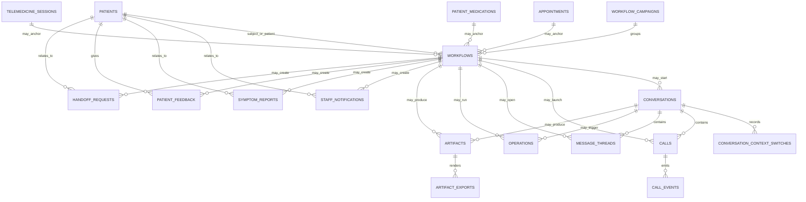
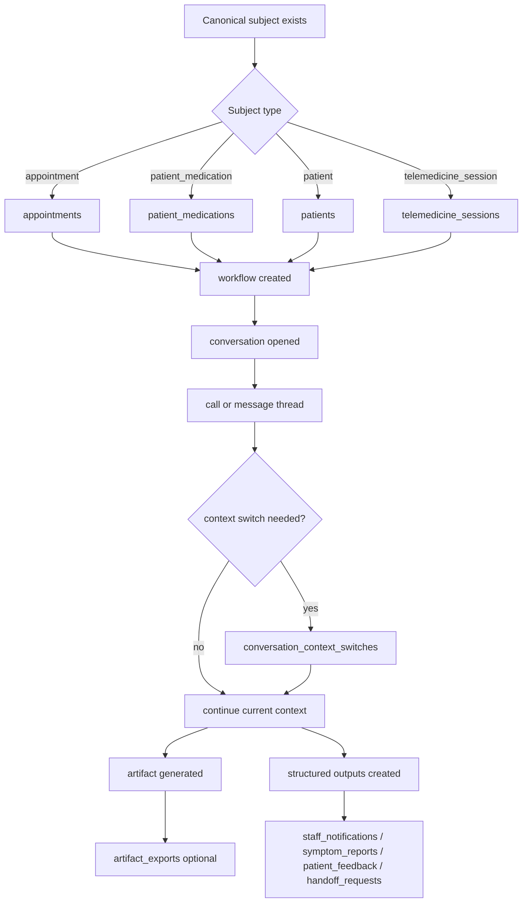

# CRM Service Schema Documentation

## Overview

This section defines the **CRM service domain** for the organizational health management system.

The design goal is to give CRM a durable home for execution truth without letting it become a second owner of patient, appointment, medication, consent, or telemedicine master data.

CRM should own:

- workflow lifecycle
- conversation and call execution records
- message-thread execution records
- operations and artifact metadata
- campaign grouping state
- structured engagement outputs produced by CRM execution

CRM should reference, not duplicate:

- patients
- practitioners
- appointments
- practitioner availability
- patient medications
- consent truth
- telemedicine sessions

---

## Design Principles

### 1. CRM owns execution truth, not canonical care truth

If a record exists because CRM executed work, CRM can own it.

If a record would still exist even if CRM were turned off, CRM should reference it rather than mirror it.

### 2. Workflow subjects must point to canonical entities

Each CRM workflow should target a canonical subject such as an appointment, patient medication, patient, or telemedicine session.

That subject link is the boundary that prevents duplication.

### 3. Artifacts are outputs, not operational masters

Generated reports, notes, and exports are important, but they must not become the only queryable record for outcomes that staff or downstream systems need to act on.

### 4. Output records should be structured and link back to execution

Staff notifications, handoffs, symptom reports, and patient feedback should remain first-class queryable records tied to the workflow, conversation, or call that produced them.

### 5. Provider callbacks should land in CRM execution records only

Telephony or messaging provider identifiers belong in CRM execution records for correlation and callback handling.

They should not leak into canonical scheduling, patient, or medication tables.

---

# Table Definitions

## 1. `workflows`

### What it stores

The durable business and execution lifecycle of a CRM workflow.

Examples include appointment reminders, medication adherence outreach, care feedback collection, and general calls.

### Fields

| Field | Description |
|---|---|
| `id` | Unique workflow identifier |
| `organization_id` | Organization that owns the workflow |
| `facility_id` | Optional facility scope |
| `workflow_type` | Type such as `appointment_reminder`, `medication_adherence`, `care_feedback`, or `general_call` |
| `status` | Status such as `pending`, `scheduled`, `in_progress`, `completed`, `failed`, `cancelled`, or `requires_followup` |
| `subject_type` | Canonical subject type such as `patient`, `appointment`, `patient_medication`, or `telemedicine_session` |
| `subject_id` | Canonical subject record identifier |
| `patient_id` | Optional direct patient link for fast filtering and reporting |
| `appointment_id` | Optional appointment link when the workflow is appointment-driven |
| `patient_medication_id` | Optional medication link when the workflow is medication-driven |
| `telemedicine_session_id` | Optional telemedicine session link when the workflow is session-driven |
| `context_version` | Runtime context version used by CRM |
| `scheduled_for` | Planned execution time if scheduled |
| `started_at` | Execution start timestamp |
| `completed_at` | Execution completion timestamp |
| `failure_reason` | Optional terminal or latest failure reason |
| `created_by` | User, system, or integration that created the workflow |
| `created_at` | Timestamp when the workflow was created |
| `updated_at` | Timestamp when the workflow was last updated |

### Important note

This table stores CRM workflow truth.
It must not be treated as the owner of appointment, medication, or telemedicine state.

---

## 2. `conversations`

### What it stores

The durable envelope for a CRM interaction thread across one workflow or one ad hoc outreach unit.

### Fields

| Field | Description |
|---|---|
| `id` | Unique conversation identifier |
| `workflow_id` | Optional parent workflow |
| `organization_id` | Organization that owns the conversation |
| `patient_id` | Patient involved in the conversation |
| `channel_type` | Channel such as `voice`, `sms`, or `mixed` |
| `status` | Status such as `open`, `active`, `completed`, `abandoned`, or `cancelled` |
| `current_context_id` | Current CRM runtime context |
| `started_at` | When the conversation started |
| `ended_at` | When the conversation ended |
| `summary` | Optional concise operational summary |
| `created_at` | Timestamp when the conversation was created |
| `updated_at` | Timestamp when the conversation was last updated |

---

## 3. `conversation_context_switches`

### What it stores

Structured history of context transitions inside a conversation.

This is useful when a call begins as an appointment reminder and transitions into diagnosis or another follow-up flow.

### Fields

| Field | Description |
|---|---|
| `id` | Unique transition record identifier |
| `conversation_id` | Conversation whose context changed |
| `from_context_id` | Prior context identifier |
| `to_context_id` | New context identifier |
| `trigger_reason` | Why the transition happened |
| `created_at` | Timestamp when the transition was recorded |

---

## 4. `calls`

### What it stores

Durable call execution records for outbound or inbound CRM voice interactions.

### Fields

| Field | Description |
|---|---|
| `id` | Unique call identifier |
| `workflow_id` | Optional parent workflow |
| `conversation_id` | Optional parent conversation |
| `organization_id` | Organization that owns the call |
| `facility_id` | Optional facility scope |
| `patient_id` | Patient involved in the call |
| `call_type` | Type such as `appointment_reminder`, `medication_adherence`, `care_feedback`, or `general_call` |
| `direction` | `outbound` or `inbound` |
| `provider` | Telephony provider |
| `provider_call_id` | Provider-specific call identifier used for callback correlation |
| `status` | Status such as `queued`, `ringing`, `in_progress`, `completed`, `failed`, `cancelled`, or `no_answer` |
| `started_at` | When the call connected or began execution |
| `ended_at` | When the call ended |
| `recording_ref` | Optional recording reference |
| `transcript_ref` | Optional transcript reference |
| `outcome_summary` | Optional concise operational outcome summary |
| `created_at` | Timestamp when the call was created |
| `updated_at` | Timestamp when the call was last updated |

### Important note

Provider identifiers belong here for correlation.
They do not belong in scheduling or clinical master records.

---

## 5. `call_events`

### What it stores

Append-only normalized call lifecycle events from CRM or provider callbacks.

### Fields

| Field | Description |
|---|---|
| `id` | Unique call event identifier |
| `call_id` | Call this event belongs to |
| `provider_event_id` | Optional provider callback event identifier for dedupe |
| `event_type` | Type such as `initiated`, `ringing`, `answered`, `completed`, `failed`, or `cancel_requested` |
| `event_source` | Source such as `provider_callback`, `crm_runtime`, or `operator_action` |
| `payload_ref` | Optional reference to raw provider payload if retained separately |
| `occurred_at` | When the event occurred |
| `created_at` | Timestamp when the event was stored |

---

## 6. `message_threads`

### What it stores

Durable SMS or messaging-thread metadata for CRM-managed contact threads.

### Fields

| Field | Description |
|---|---|
| `id` | Unique thread identifier |
| `workflow_id` | Optional parent workflow |
| `conversation_id` | Optional parent conversation |
| `organization_id` | Organization that owns the thread |
| `patient_id` | Patient participating in the thread |
| `provider` | Messaging provider |
| `provider_thread_id` | Provider-specific thread identifier |
| `status` | Status such as `active`, `completed`, `failed`, or `opted_out` |
| `last_message_at` | Timestamp of the latest thread activity |
| `created_at` | Timestamp when the thread was created |
| `updated_at` | Timestamp when the thread was last updated |

---

## 7. `operations`

### What it stores

Durable records for asynchronous or multi-stage CRM work such as extraction, export generation, or bulk dispatch coordination.

### Fields

| Field | Description |
|---|---|
| `id` | Unique operation identifier |
| `organization_id` | Organization that owns the operation |
| `workflow_id` | Optional related workflow |
| `conversation_id` | Optional related conversation |
| `call_id` | Optional related call |
| `operation_type` | Type such as `artifact_extraction`, `pdf_export`, or `campaign_dispatch` |
| `status` | Status such as `pending`, `running`, `completed`, `failed`, or `cancelled` |
| `subject_type` | Optional related subject type |
| `subject_id` | Optional related subject identifier |
| `started_at` | When processing started |
| `completed_at` | When processing completed |
| `failure_reason` | Optional failure reason |
| `created_at` | Timestamp when the operation was created |
| `updated_at` | Timestamp when the operation was last updated |

---

## 8. `artifacts`

### What it stores

Metadata for CRM-generated structured outputs and their payload references.

Examples include appointment call notes, medication adherence reports, care feedback reports, general call notes, and diagnosis summaries.

### Fields

| Field | Description |
|---|---|
| `id` | Unique artifact identifier |
| `organization_id` | Organization that owns the artifact |
| `workflow_id` | Optional originating workflow |
| `conversation_id` | Optional originating conversation |
| `call_id` | Optional originating call |
| `operation_id` | Optional originating operation |
| `artifact_type` | Built-in or custom artifact type |
| `schema_id` | Schema identifier used by the artifact payload |
| `subject_type` | Canonical subject type the artifact is about |
| `subject_id` | Canonical subject identifier the artifact is about |
| `payload_ref` | Reference to the structured payload or object-storage location |
| `status` | Status such as `draft`, `finalized`, `exported`, or `superseded` |
| `created_at` | Timestamp when the artifact was created |
| `updated_at` | Timestamp when the artifact was last updated |

### Important note

Artifact payloads may contain clinically useful content, but they are not a replacement for first-class scheduling, medication, consent, or engagement-output records.

---

## 9. `artifact_exports`

### What it stores

Metadata for rendered or exported artifact outputs such as PDFs or plaintext exports.

### Fields

| Field | Description |
|---|---|
| `id` | Unique export identifier |
| `artifact_id` | Artifact being exported |
| `exporter_id` | Exporter or renderer identifier |
| `file_ref` | Output file or object reference |
| `status` | Status such as `pending`, `completed`, or `failed` |
| `created_at` | Timestamp when the export record was created |
| `updated_at` | Timestamp when the export record was last updated |

---

## 10. `custom_form_definitions`

### What it stores

Tenant-authored extraction form definitions resolved by CRM when a caller requests a custom form instead of a built-in artifact.

### Fields

| Field | Description |
|---|---|
| `id` | Unique custom form identifier |
| `organization_id` | Organization that owns the form |
| `form_key` | Stable tenant-scoped form key |
| `version` | Published form version |
| `status` | Status such as `draft`, `published`, `deprecated`, or `retired` |
| `display_name` | Human-friendly form name |
| `description` | Optional description |
| `json_schema` | Declarative schema payload |
| `extraction_instructions` | Extraction guidance text |
| `field_descriptions` | Optional field help metadata |
| `created_at` | Timestamp when the form was created |
| `updated_at` | Timestamp when the form was last updated |

### Important note

This is the only runtime-definition-like data CRM should resolve from the DB side.
Built-in contexts, tasks, and built-in artifact schemas remain code-owned in CRM.

---

## 11. `workflow_campaigns`

### What it stores

Grouping and progress state for bulk CRM launches such as reminder waves or outreach batches.

### Fields

| Field | Description |
|---|---|
| `id` | Unique campaign identifier |
| `organization_id` | Organization that owns the campaign |
| `campaign_type` | Type such as `appointment_reminder_batch` or `medication_adherence_batch` |
| `status` | Status such as `draft`, `running`, `paused`, `completed`, or `cancelled` |
| `total_subjects` | Total targeted subjects |
| `completed_count` | Count of completed child executions |
| `failed_count` | Count of failed child executions |
| `cancelled_count` | Count of cancelled child executions |
| `created_at` | Timestamp when the campaign was created |
| `updated_at` | Timestamp when the campaign was last updated |

---

## 12. `staff_notifications`

### What it stores

Structured staff-facing notifications or alert records produced by CRM execution.

### Fields

| Field | Description |
|---|---|
| `id` | Unique notification identifier |
| `organization_id` | Organization that owns the notification |
| `workflow_id` | Optional originating workflow |
| `conversation_id` | Optional originating conversation |
| `call_id` | Optional originating call |
| `patient_id` | Related patient |
| `subject_type` | Optional linked subject type |
| `subject_id` | Optional linked subject identifier |
| `notification_type` | Type such as `urgent_symptom_alert`, `followup_needed`, or `refill_attention` |
| `priority` | Priority such as `low`, `medium`, `high`, or `urgent` |
| `status` | Status such as `open`, `acknowledged`, `resolved`, or `dismissed` |
| `summary` | Staff-facing summary |
| `created_at` | Timestamp when the notification was created |
| `updated_at` | Timestamp when the notification was last updated |

---

## 13. `symptom_reports`

### What it stores

Structured symptom or triage outputs captured by CRM workflows and linked to the patient and triggering execution.

### Fields

| Field | Description |
|---|---|
| `id` | Unique symptom report identifier |
| `organization_id` | Organization that owns the report |
| `workflow_id` | Optional originating workflow |
| `conversation_id` | Optional originating conversation |
| `call_id` | Optional originating call |
| `patient_id` | Patient the report is about |
| `appointment_id` | Optional related appointment |
| `patient_medication_id` | Optional related medication |
| `severity` | Severity such as `low`, `medium`, `high`, or `urgent` |
| `red_flag_present` | Whether red-flag symptoms were identified |
| `summary` | Structured or concise symptom summary |
| `status` | Status such as `open`, `reviewed`, or `resolved` |
| `created_at` | Timestamp when the report was created |
| `updated_at` | Timestamp when the report was last updated |

---

## 14. `patient_feedback`

### What it stores

Structured care-experience feedback captured by CRM workflows.

### Fields

| Field | Description |
|---|---|
| `id` | Unique feedback identifier |
| `organization_id` | Organization that owns the feedback record |
| `workflow_id` | Optional originating workflow |
| `conversation_id` | Optional originating conversation |
| `call_id` | Optional originating call |
| `patient_id` | Patient who gave the feedback |
| `appointment_id` | Optional related appointment or visit anchor |
| `rating` | Optional scalar rating when captured |
| `summary` | Concise summary of feedback |
| `free_text_response` | Optional verbatim patient feedback |
| `status` | Status such as `new`, `reviewed`, or `closed` |
| `created_at` | Timestamp when the feedback record was created |
| `updated_at` | Timestamp when the feedback record was last updated |

---

## 15. `handoff_requests`

### What it stores

Structured follow-up requests created when CRM determines a human should take over or continue the case.

### Fields

| Field | Description |
|---|---|
| `id` | Unique handoff identifier |
| `organization_id` | Organization that owns the handoff |
| `workflow_id` | Optional originating workflow |
| `conversation_id` | Optional originating conversation |
| `call_id` | Optional originating call |
| `patient_id` | Related patient |
| `subject_type` | Optional linked subject type such as `appointment`, `patient_medication`, or `telemedicine_session` |
| `subject_id` | Optional linked subject identifier |
| `handoff_type` | Type such as `clinical_review`, `reschedule_assistance`, `refill_followup`, or `service_recovery` |
| `priority` | Priority such as `low`, `medium`, `high`, or `urgent` |
| `status` | Status such as `open`, `accepted`, `resolved`, or `cancelled` |
| `summary` | Staff-facing summary of required follow-up |
| `due_at` | Optional due timestamp |
| `created_at` | Timestamp when the handoff was created |
| `updated_at` | Timestamp when the handoff was last updated |

---

# Relationship Summary

## CRM execution relationships

* One `workflow` can produce many `conversations`, `calls`, `message_threads`, `operations`, and `artifacts`
* One `conversation` can have many `conversation_context_switches`, `calls`, `operations`, and `artifacts`
* One `call` can have many `call_events`
* One `artifact` can have many `artifact_exports`
* One `workflow_campaign` can group many `workflows`

## CRM output relationships

* One `workflow` may create many `staff_notifications`
* One `workflow` may create many `symptom_reports`
* One `workflow` may create many `patient_feedback` records
* One `workflow` may create many `handoff_requests`

## Canonical linkage rules

* A workflow must reference canonical subjects rather than duplicating master records
* Medication-related CRM outputs must link to `patient_medications`
* Appointment-related CRM outputs must link to `appointments`
* Contact-policy checks must read canonical consent state rather than storing CRM-local consent truth

---

# Mermaid ER Diagram

---

# Sample CRM Flow

This sample flow shows how CRM execution records connect during a typical outreach lifecycle without taking ownership of the underlying business entity.

---

# Example Lifecycle

## Step 1: Canonical subject already exists

The workflow does not create the business subject.
It points to a canonical record such as an `appointment`, `patient_medication`, `patient`, or later a `telemedicine_session`.

## Step 2: CRM creates execution records

A `workflow` is created first.
That workflow may create a `conversation`, `call`, `message_thread`, `operation`, and one or more `artifacts`.

## Step 3: Runtime may switch conversational context

If the live interaction changes direction, the system records the transition in `conversation_context_switches`.
This changes runtime behavior without changing the canonical subject owner.

## Step 4: CRM stores queryable outcomes

If the workflow produces actionable outcomes, those are stored as structured records such as `staff_notifications`, `symptom_reports`, `patient_feedback`, or `handoff_requests`.

## Step 5: CRM may also render artifact outputs

The same workflow may generate `artifacts` and optional `artifact_exports`, but those outputs do not replace the structured operational records.

---

# Review Notes

Reject a CRM-side design if it:

- introduces a second patient, appointment, medication, practitioner, or consent master
- stores operational outcomes only inside artifact payloads when staff need structured queries
- collapses call-provider callback state into scheduling or clinical tables
- treats telemedicine session truth as just another CRM call status
