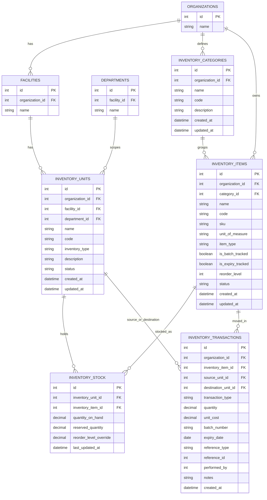
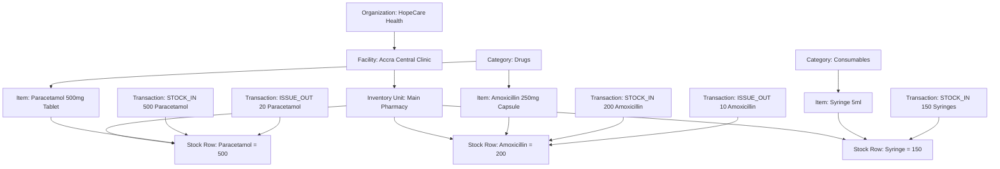

# Inventory Schema Documentation

## Overview

This inventory design is intended for a customizable organizational health management system where different organizations and facilities may operate different kinds of stores or stock-holding units.

Instead of hardcoding separate modules and tables such as `pharmacy`, `warehouse`, `laundry`, or `lab_store`, the platform uses a **configurable inventory engine**. In this model:

* a pharmacy is represented as an **inventory unit**
* a laundry supplies store is represented as an **inventory unit**
* a lab reagents store is represented as an **inventory unit**
* all of them use the same underlying stock and transaction model

This gives the platform flexibility while preserving a stable core schema for stock management, reporting, auditing, and future integrations.

---

## Design Principles

### 1. Fixed operational core

The system should always understand core inventory operations such as:

* stock-in
* stock-out / issue-out
* transfer
* adjustment
* reorder checks
* optional batch tracking
* optional expiry tracking

### 2. Configurable business vocabulary

Each organization can define inventory areas in a way that matches its operations.

Examples:

* Main Pharmacy
* Central Store
* Laundry Supplies
* Lab Reagents Store
* Theatre Store

### 3. Flexible but not fully free-form

The schema is intentionally not designed as a completely spreadsheet-like arbitrary table system because inventory behavior depends on a stable model.

A fully arbitrary table model would make it difficult to support:

* transfers
* stock calculations
* expiry handling
* low stock alerts
* standardized reporting
* access control
* auditing

The recommended model is therefore a **hybrid**:

* structured core inventory tables
* optional custom field extensions later if needed

---

# Inventory Tables

## 1. `inventory_units`

### What it represents

Represents a logical stock-holding unit, store, or inventory location within an organization or facility.

This is the table that allows the platform to represent things like:

* Main Pharmacy
* Emergency Store
* Central Warehouse
* Laundry Supplies
* Lab Reagents Store

### Fields

| Field             | Description                                                            |
| ----------------- | ---------------------------------------------------------------------- |
| `id`              | Unique identifier for the inventory unit                               |
| `organization_id` | Organization that owns the inventory unit                              |
| `facility_id`     | Facility or branch where the inventory unit exists                     |
| `department_id`   | Optional department scope if the inventory unit is department-specific |
| `name`            | Display name of the inventory unit                                     |
| `code`            | Unique or semi-structured code for the inventory unit                  |
| `inventory_type`  | Broad type such as `pharmacy`, `store`, `lab`, `laundry`, or `custom`  |
| `description`     | Optional explanation of the unit’s purpose                             |
| `status`          | Operational state such as `active` or `inactive`                       |
| `created_at`      | Timestamp when the unit was created                                    |
| `updated_at`      | Timestamp when the unit was last updated                               |

---

## 2. `inventory_categories`

### What it represents

Represents item groupings used to classify inventory items.

Examples:

* Drugs
* Consumables
* Reagents
* Linens
* Cleaning Supplies
* Equipment Accessories

### Fields

| Field             | Description                                  |
| ----------------- | -------------------------------------------- |
| `id`              | Unique identifier for the inventory category |
| `organization_id` | Organization that owns the category          |
| `name`            | Name of the category                         |
| `code`            | Optional category code                       |
| `description`     | Optional description of the category         |
| `created_at`      | Timestamp when the category was created      |
| `updated_at`      | Timestamp when the category was last updated |

---

## 3. `inventory_items`

### What it represents

Represents the organization’s master list of inventory items.

This is the core item catalog and is not tied to one specific inventory unit. The same item can exist in multiple inventory units.

Examples:

* Paracetamol 500mg Tablet
* Amoxicillin 250mg Capsule
* Syringe 5ml
* Bed Sheet White
* CBC Reagent A

### Fields

| Field               | Description                                                                |
| ------------------- | -------------------------------------------------------------------------- |
| `id`                | Unique identifier for the inventory item                                   |
| `organization_id`   | Organization that owns the item definition                                 |
| `category_id`       | Category the item belongs to                                               |
| `name`              | Item name                                                                  |
| `code`              | Internal item code                                                         |
| `sku`               | Stock keeping unit                                                         |
| `unit_of_measure`   | Unit such as `tablet`, `capsule`, `piece`, `bottle`                        |
| `item_type`         | Broad item type such as `drug`, `consumable`, `reagent`, `linen`, `custom` |
| `is_batch_tracked`  | Indicates whether item batches are tracked                                 |
| `is_expiry_tracked` | Indicates whether expiry dates are tracked                                 |
| `reorder_level`     | Threshold for low-stock alerts                                             |
| `status`            | Item status such as `active` or `inactive`                                 |
| `created_at`        | Timestamp when the item was created                                        |
| `updated_at`        | Timestamp when the item was last updated                                   |

---

## 4. `inventory_stock`

### What it represents

Represents the current stock balance of a particular inventory item within a specific inventory unit.

This is the table that answers questions such as:

* How much Paracetamol is currently in Main Pharmacy?
* How many syringes are available in Emergency Store?
* How much detergent is left in Laundry Supplies?

### Fields

| Field                    | Description                                     |
| ------------------------ | ----------------------------------------------- |
| `id`                     | Unique identifier for the stock balance row     |
| `inventory_unit_id`      | Inventory unit holding the stock                |
| `inventory_item_id`      | Item whose stock is being tracked               |
| `quantity_on_hand`       | Current available quantity physically present   |
| `reserved_quantity`      | Quantity reserved for pending use or allocation |
| `reorder_level_override` | Optional location-specific reorder threshold    |
| `last_updated_at`        | Timestamp of last stock balance update          |

### Important note

A unique constraint should typically exist on:

* `(inventory_unit_id, inventory_item_id)`

This prevents duplicate stock rows for the same item in the same inventory unit.

---

## 5. `inventory_transactions`

### What it represents

Represents the movement history of inventory items.

This is the table that explains **how stock changed over time**.

Examples of transaction types:

* `STOCK_IN`
* `ISSUE_OUT`
* `TRANSFER`
* `ADJUSTMENT`
* `RETURN`
* `DISCARD`

### Fields

| Field                 | Description                                                                                  |
| --------------------- | -------------------------------------------------------------------------------------------- |
| `id`                  | Unique identifier for the transaction                                                        |
| `organization_id`     | Organization that owns the transaction                                                       |
| `inventory_item_id`   | Item involved in the transaction                                                             |
| `source_unit_id`      | Inventory unit stock is coming from, if applicable                                           |
| `destination_unit_id` | Inventory unit stock is going to, if applicable                                              |
| `transaction_type`    | Type of inventory movement                                                                   |
| `quantity`            | Quantity moved                                                                               |
| `unit_cost`           | Optional unit cost at the time of transaction                                                |
| `batch_number`        | Optional batch or lot number                                                                 |
| `expiry_date`         | Optional expiry date for tracked items                                                       |
| `reference_type`      | Optional business reference type such as `purchase_order`, `prescription`, `adjustment_note` |
| `reference_id`        | Optional identifier of the business reference                                                |
| `performed_by`        | User or staff member who performed or recorded the transaction                               |
| `notes`               | Optional additional notes                                                                    |
| `created_at`          | Timestamp when the transaction was created                                                   |

### How to interpret source and destination

* `STOCK_IN`: `source_unit_id` may be `null`, `destination_unit_id` is populated
* `ISSUE_OUT`: `source_unit_id` is populated, `destination_unit_id` may be `null`
* `TRANSFER`: both `source_unit_id` and `destination_unit_id` are populated

---

# Table Relationships

## Relationship Summary

* An **organization** can have many **inventory units**
* A **facility** can have many **inventory units**
* A **department** can optionally own or scope many **inventory units**
* An **organization** can define many **inventory categories**
* An **inventory category** can contain many **inventory items**
* An **inventory unit** can hold many **stock balance records**
* An **inventory item** can appear in many **stock balance records**
* An **inventory item** can appear in many **inventory transactions**
* An **inventory unit** can participate in many **inventory transactions** as a source or destination

## Relationship Notes

### `inventory_units -> inventory_stock`

One inventory unit can hold many stock records because each unit may store many different items.

### `inventory_items -> inventory_stock`

One inventory item can appear in many stock records because the same item can be stored in multiple inventory units.

### `inventory_items -> inventory_transactions`

One inventory item can appear in many transaction records because it may be stocked, issued, transferred, adjusted, or discarded many times.

### `inventory_units -> inventory_transactions`

An inventory unit can appear in many transactions either as the origin of stock movement or the destination of stock movement.

---

# Mermaid ER Diagram

---

# Visual Flow Example: Main Pharmacy

## Scenario

A facility under an organization creates an inventory unit called **Main Pharmacy**. The pharmacy stores items such as:

* Paracetamol 500mg Tablet
* Amoxicillin 250mg Capsule
* Syringe 5ml

These items are defined in the item master, linked to categories, stocked in the Main Pharmacy, and moved through inventory transactions.

## Mermaid Visual Flow

---

# Dummy Data Example: Main Pharmacy

## `organizations`

| id | name            |
| -- | --------------- |
| 1  | HopeCare Health |

## `facilities`

| id | organization_id | name                 |
| -- | --------------: | -------------------- |
| 1  |               1 | Accra Central Clinic |

## `inventory_units`

| id | organization_id | facility_id | department_id | name          | code      | inventory_type | status |
| -- | --------------: | ----------: | ------------: | ------------- | --------- | -------------- | ------ |
| 1  |               1 |           1 |          null | Main Pharmacy | PHARM-001 | pharmacy       | active |

## `inventory_categories`

| id | organization_id | name        | code        |
| -- | --------------: | ----------- | ----------- |
| 1  |               1 | Drugs       | DRUGS       |
| 2  |               1 | Consumables | CONSUMABLES |

## `inventory_items`

| id | organization_id | category_id | name                      | sku      | unit_of_measure | item_type  | is_batch_tracked | is_expiry_tracked | reorder_level | status |
| -- | --------------: | ----------: | ------------------------- | -------- | --------------- | ---------- | ---------------- | ----------------- | ------------: | ------ |
| 1  |               1 |           1 | Paracetamol 500mg Tablet  | DRG-0001 | tablet          | drug       | true             | true              |           100 | active |
| 2  |               1 |           1 | Amoxicillin 250mg Capsule | DRG-0002 | capsule         | drug       | true             | true              |            50 | active |
| 3  |               1 |           2 | Syringe 5ml               | CNS-0001 | piece           | consumable | false            | false             |            40 | active |

## `inventory_stock`

| id | inventory_unit_id | inventory_item_id | quantity_on_hand | reserved_quantity | reorder_level_override | last_updated_at     |
| -- | ----------------: | ----------------: | ---------------: | ----------------: | ---------------------: | ------------------- |
| 1  |                 1 |                 1 |              500 |                20 |                   null | 2026-04-10 10:30:00 |
| 2  |                 1 |                 2 |              200 |                10 |                   null | 2026-04-10 10:30:00 |
| 3  |                 1 |                 3 |              150 |                 0 |                   null | 2026-04-10 10:30:00 |

## `inventory_transactions`

| id | organization_id | inventory_item_id | source_unit_id | destination_unit_id | transaction_type | quantity | unit_cost | batch_number | expiry_date | reference_type | reference_id | performed_by | created_at          |
| -- | --------------: | ----------------: | -------------: | ------------------: | ---------------- | -------: | --------: | ------------ | ----------- | -------------- | -----------: | -----------: | ------------------- |
| 1  |               1 |                 1 |           null |                   1 | STOCK_IN         |      500 |      0.50 | PCM-APR-001  | 2027-03-31  | purchase_order |          101 |           12 | 2026-04-09 09:00:00 |
| 2  |               1 |                 2 |           null |                   1 | STOCK_IN         |      200 |      1.20 | AMX-APR-004  | 2026-12-31  | purchase_order |          102 |           12 | 2026-04-09 09:15:00 |
| 3  |               1 |                 3 |           null |                   1 | STOCK_IN         |      150 |      0.80 | null         | null        | purchase_order |          103 |           12 | 2026-04-09 09:20:00 |
| 4  |               1 |                 1 |              1 |                null | ISSUE_OUT        |       20 |      0.50 | PCM-APR-001  | 2027-03-31  | prescription   |         9001 |           18 | 2026-04-10 08:10:00 |
| 5  |               1 |                 2 |              1 |                null | ISSUE_OUT        |       10 |      1.20 | AMX-APR-004  | 2026-12-31  | prescription   |         9002 |           18 | 2026-04-10 08:25:00 |

---

# How to Mentally Read the Model

## `inventory_items`

This answers: **What things does the organization manage?**

## `inventory_units`

This answers: **Where are those things stored or issued from?**

## `inventory_stock`

This answers: **How much of each thing is currently in each place?**

## `inventory_transactions`

This answers: **How did the stock change over time?**

---

# Why This Works for a Pharmacy

A pharmacy does not need its own hardcoded table.

Instead:

* the pharmacy is represented as an `inventory_unit`
* drugs and pharmacy supplies are represented as `inventory_items`
* available quantities are represented in `inventory_stock`
* all stock movement is represented in `inventory_transactions`

This gives the system the flexibility to represent many other inventory domains using the same structure, while keeping the behavior of inventory operations consistent and reliable.

---

