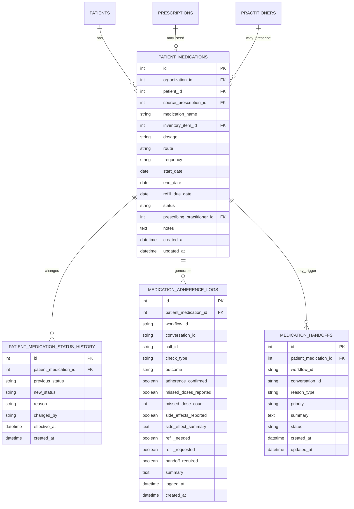
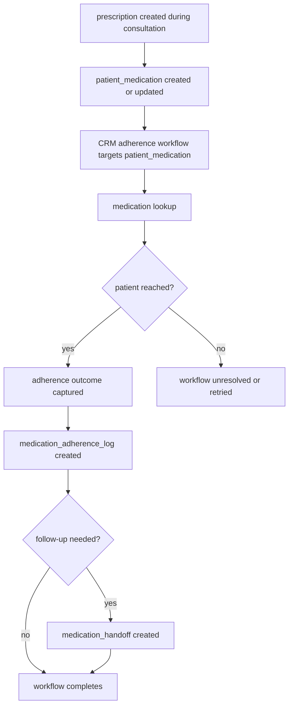

# Medication Schema Documentation

## Overview

This section defines the **medication domain** for the organizational health management system.

The design goal is to avoid a common failure mode:

- using visit-time `prescriptions` as if they are the full longitudinal medication truth
- creating a second CRM-owned medication master record for adherence workflows

Instead, the model separates:

- the clinical prescribing event
- the longitudinal patient medication record
- medication adherence and refill workflow outputs

That keeps one canonical medication truth while still supporting CRM adherence, refill, and escalation workflows cleanly.

---

## Design Principles

### 1. Separate prescribing events from longitudinal medication truth

A `prescription` is a clinical event generated during a consultation or visit.

A `patient_medication` is the patient’s longitudinal therapy record used for ongoing adherence, refill, discontinuation, and workflow linkage.

### 2. CRM must reference canonical medication records

CRM adherence workflows should link to canonical patient medication records.

CRM should not maintain a second authoritative medication master.

### 3. Medication workflow outputs should be append-only

Adherence checks, refill findings, and escalation or handoff outcomes should be stored as related history records rather than overwriting the medication master repeatedly.

### 4. Prescriptions may create or update medication lifecycle records

The exact operational rule may vary by product workflow, but the model should support prescriptions feeding the canonical medication record rather than competing with it.

---

# Table Definitions

## 1. `patient_medications`

### What it stores

The patient’s canonical longitudinal medication therapy record.

This is the main medication truth that CRM adherence workflows, refill workflows, and discontinuation logic should reference.

### Fields

| Field | Description |
|---|---|
| `id` | Unique identifier for the patient medication record |
| `organization_id` | Organization that owns the medication record |
| `patient_id` | Patient taking or intended to take the medication |
| `source_prescription_id` | Optional originating prescription record |
| `medication_name` | Canonical medication name |
| `inventory_item_id` | Optional linked inventory item when pharmacy stock is modeled in-system |
| `dosage` | Dosage instruction |
| `route` | Route of administration |
| `frequency` | Frequency of use |
| `start_date` | Date therapy starts |
| `end_date` | Planned therapy end date if known |
| `refill_due_date` | Date when refill attention is due if applicable |
| `status` | Status such as `active`, `paused`, `completed`, `discontinued`, or `expired` |
| `prescribing_practitioner_id` | Optional practitioner responsible for the current therapy plan |
| `notes` | Medication-level notes relevant across encounters |
| `created_at` | Timestamp when the patient medication record was created |
| `updated_at` | Timestamp when the patient medication record was last updated |

### Important note

This is the canonical medication truth CRM should reference for adherence workflows. It should not be replaced by artifacts, CRM workflow metadata, or repeated prescription rows.

---

## 2. `patient_medication_status_history`

### What it stores

Append-friendly history of medication status changes over time.

### Fields

| Field | Description |
|---|---|
| `id` | Unique identifier for the status history record |
| `patient_medication_id` | Medication whose status changed |
| `previous_status` | Prior status |
| `new_status` | New status |
| `reason` | Optional reason for the status change |
| `changed_by` | User, system, or integration responsible |
| `effective_at` | When the new status became effective |
| `created_at` | Timestamp when the history row was created |

### Important note

If the system needs a reliable discontinuation trail or audit review, this table is better than repeatedly inferring status changes from the current medication row alone.

---

## 3. `medication_adherence_logs`

### What it stores

Append-only results of adherence and refill-related outreach or checks linked to a canonical patient medication record.

### Fields

| Field | Description |
|---|---|
| `id` | Unique identifier for the adherence log |
| `patient_medication_id` | Canonical medication record this log refers to |
| `workflow_id` | Optional CRM workflow that produced the log |
| `conversation_id` | Optional CRM conversation that produced the log |
| `call_id` | Optional CRM call that produced the log |
| `check_type` | Type such as `scheduled_adherence`, `refill_reminder`, or `side_effect_followup` |
| `outcome` | Outcome such as `adherent`, `non_adherent`, `partially_adherent`, `handoff_required`, or `unresolved` |
| `adherence_confirmed` | Whether adherence was explicitly confirmed |
| `missed_doses_reported` | Whether missed doses were reported |
| `missed_dose_count` | Optional count if reported |
| `side_effects_reported` | Whether side effects were reported |
| `side_effect_summary` | Optional structured or narrative summary |
| `refill_needed` | Whether refill need was identified |
| `refill_requested` | Whether refill was requested or flagged |
| `handoff_required` | Whether staff follow-up is required |
| `summary` | Short synthesized outcome summary |
| `logged_at` | When the adherence result was captured |
| `created_at` | Timestamp when the log row was created |

### Important note

This table stores workflow outputs linked to canonical medication truth. It is not a replacement for `patient_medications`.

---

## 4. `medication_handoffs`

### What it stores

Structured staff follow-up or escalation requests originating from medication workflows.

### Fields

| Field | Description |
|---|---|
| `id` | Unique identifier for the handoff record |
| `patient_medication_id` | Medication that triggered the handoff |
| `workflow_id` | Optional CRM workflow that triggered the handoff |
| `conversation_id` | Optional CRM conversation that triggered the handoff |
| `reason_type` | Reason such as `side_effect_reported`, `refill_issue`, `non_adherence`, or `patient_requested_help` |
| `priority` | Priority such as `low`, `medium`, `high`, or `urgent` |
| `summary` | Staff-facing summary of why the handoff exists |
| `status` | Status such as `open`, `acknowledged`, `resolved`, or `cancelled` |
| `created_at` | Timestamp when the handoff was created |
| `updated_at` | Timestamp when the handoff was last updated |

---

# Relationship Summary

## Core medication relationships

* A patient can have many `patient_medications`
* A `prescription` may create or update one `patient_medication`
* A `patient_medication` can have many `patient_medication_status_history` rows
* A `patient_medication` can have many `medication_adherence_logs`
* A `patient_medication` can have many `medication_handoffs`

## CRM linkage relationships

* A CRM workflow may target one canonical `patient_medication`
* One medication adherence workflow may produce one or more `medication_adherence_logs`
* One adherence or refill workflow may create zero or more `medication_handoffs`

---

# Mermaid ER Diagram

---

# Sample Medication Flow

This sample flow shows how medication stays canonical while CRM contributes adherence and follow-up outputs.

---

# Example Lifecycle

## Step 1: Clinical prescribing creates the medication starting point

A `prescription` may create or update a canonical `patient_medication`.
The prescription is the clinical event.
The patient medication record is the longitudinal therapy truth.

## Step 2: CRM references the canonical medication record

Medication adherence or refill workflows should point to `patient_medications`.
They should not create a second CRM-owned medication master.

## Step 3: Workflow outputs are stored separately

Adherence and refill outcomes should be written to `medication_adherence_logs`.
If human follow-up is needed, the workflow should create a `medication_handoff`.

## Step 4: Medication truth remains consistent

The current medication state remains on the canonical `patient_medications` record, while status-change history lives in `patient_medication_status_history`.

---

# Practical Interpretation

## Step 1: A prescription is written

A clinician creates a `prescriptions` record during a visit or consultation.

## Step 2: Medication lifecycle truth is established

That prescription may create or update a canonical `patient_medications` record for the patient’s ongoing therapy.

## Step 3: CRM adherence workflow links to the canonical medication record

CRM workflows should use the canonical `patient_medications.id` as the medication subject rather than duplicating the medication master inside CRM-owned tables.

## Step 4: Adherence or refill outreach happens

The workflow may produce a `medication_adherence_logs` row and optionally a `medication_handoffs` row when follow-up is needed.

## Step 5: Status changes remain queryable

If the therapy is paused, resumed, completed, or discontinued, `patient_medications.status` changes and may also produce a `patient_medication_status_history` row for auditability.
