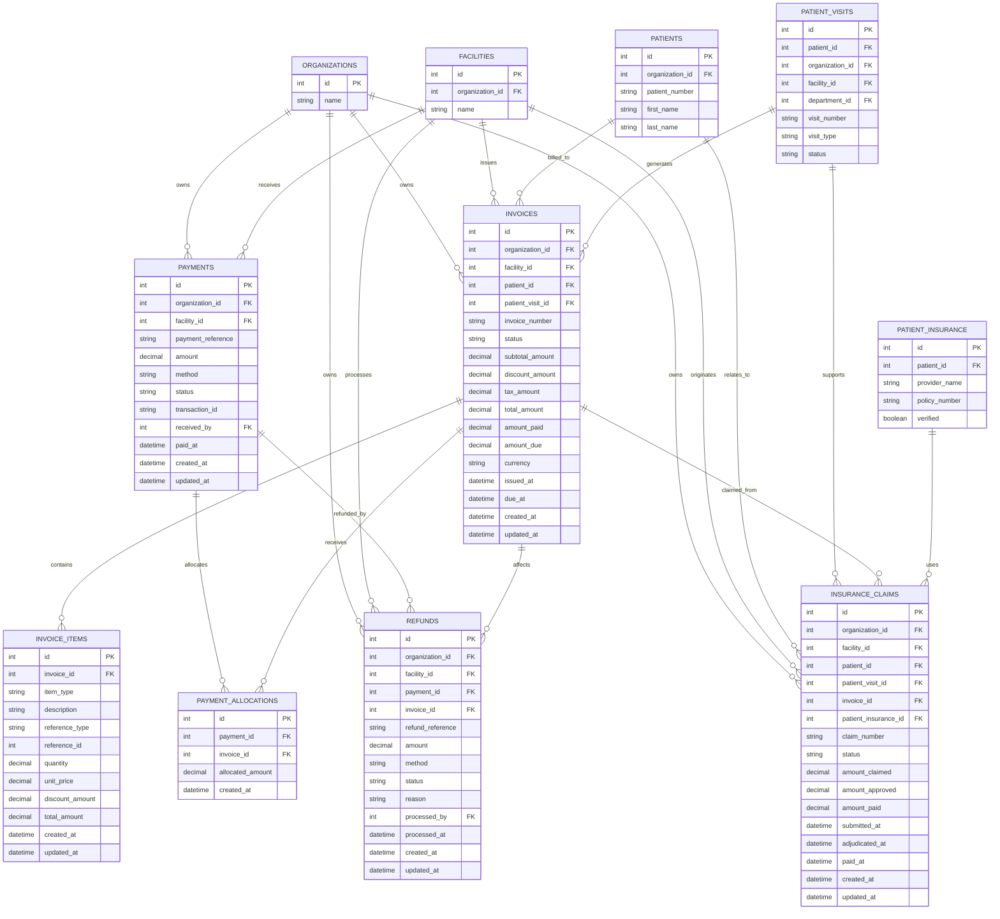
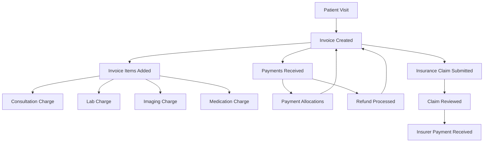

# Billing & Finance Schema Documentation

## Overview

This section defines the **billing and finance domain** for the organizational health management system.

The goal of this design is to clearly separate:

* the bill itself
* the charge lines inside the bill
* actual money received from the patient or another payer
* how payments are allocated to invoices
* insurance claims submitted for covered charges

This separation makes the billing model flexible enough to support:

* one invoice with many charge lines
* one invoice paid through multiple partial payments
* one payment allocated across invoices if needed later
* insurance-driven workflows alongside direct patient payments

For now, pricing is assumed to come from the existing **service catalog** and not from separate price list or tariff tables.

---

## Design Principles

### 1. Separate charges from payments

An invoice represents what is owed. A payment represents money actually received. They should not be treated as the same thing.

### 2. Support partial payments

A patient may pay an invoice in installments, so a single invoice can have many payments over time.

### 3. Keep invoice items tied to operational sources

Where possible, invoice lines should reference the originating workflow record such as a consultation service, lab order, imaging order, or prescription.

### 4. Keep insurance claims separate from payments

Insurance claims represent amounts requested from insurers. They are not the same as direct payments.

---

# Table Definitions

## 1. `invoices`

### What it stores

The invoice header or billing document for a patient encounter.

This table represents the overall bill and summarizes the financial totals for a patient visit.

### Fields

| Field              | Description                                                                                  |
| ------------------ | -------------------------------------------------------------------------------------------- |
| `id`               | Unique identifier for the invoice                                                            |
| `organization_id`  | Organization that owns the invoice                                                           |
| `facility_id`      | Facility where the invoice was generated                                                     |
| `patient_id`       | Patient being billed                                                                         |
| `patient_visit_id` | Visit the invoice is associated with                                                         |
| `invoice_number`   | Human-readable invoice number                                                                |
| `status`           | Invoice status such as `draft`, `issued`, `partially_paid`, `paid`, `cancelled`, or `voided` |
| `subtotal_amount`  | Sum of item amounts before discounts or tax                                                  |
| `discount_amount`  | Total discounts applied to the invoice                                                       |
| `tax_amount`       | Tax amount if applicable                                                                     |
| `total_amount`     | Final total invoice amount                                                                   |
| `amount_paid`      | Total amount paid so far                                                                     |
| `amount_due`       | Remaining unpaid balance                                                                     |
| `currency`         | Currency code such as `GHS`                                                                  |
| `issued_at`        | Timestamp when the invoice was issued                                                        |
| `due_at`           | Optional payment due date                                                                    |
| `created_at`       | Timestamp when the invoice record was created                                                |
| `updated_at`       | Timestamp when the invoice record was last updated                                           |

---

## 2. `invoice_items`

### What it stores

The line items that make up an invoice.

Each record represents one charge component on the invoice.

Examples:

* consultation fee
* lab test charge
* imaging charge
* medication charge
* procedure charge

### Fields

| Field             | Description                                                                                        |
| ----------------- | -------------------------------------------------------------------------------------------------- |
| `id`              | Unique identifier for the invoice item                                                             |
| `invoice_id`      | Invoice the line item belongs to                                                                   |
| `item_type`       | Broad type of billed item such as `service`, `lab`, `imaging`, `drug`, or `other`                  |
| `description`     | Human-readable description of the charge                                                           |
| `reference_type`  | Source record type such as `consultation_service`, `lab_order`, `imaging_order`, or `prescription` |
| `reference_id`    | Identifier of the source record                                                                    |
| `quantity`        | Quantity billed                                                                                    |
| `unit_price`      | Price per unit at the time of billing                                                              |
| `discount_amount` | Discount applied to this line item                                                                 |
| `total_amount`    | Final line total after discounts                                                                   |
| `created_at`      | Timestamp when the invoice item was created                                                        |
| `updated_at`      | Timestamp when the invoice item was last updated                                                   |

### Important note

Using `reference_type` and `reference_id` makes billing more traceable because each invoice line can be linked back to the source workflow record.

---

## 3. `payments`

### What it stores

Actual payment transactions received against invoices.

A payment record represents money collection activity, not the invoice itself.

### Fields

| Field               | Description                                                                        |
| ------------------- | ---------------------------------------------------------------------------------- |
| `id`                | Unique identifier for the payment                                                  |
| `organization_id`   | Organization that owns the payment record                                          |
| `facility_id`       | Facility where the payment was received or recorded                                |
| `payment_reference` | Internal payment reference number                                                  |
| `amount`            | Total payment amount received                                                      |
| `method`            | Payment method such as `cash`, `card`, `mobile_money`, or `bank_transfer`          |
| `status`            | Payment status such as `pending`, `completed`, `failed`, `reversed`, or `refunded` |
| `transaction_id`    | External payment gateway or banking transaction identifier if applicable           |
| `received_by`       | User or cashier who recorded the payment                                           |
| `paid_at`           | Timestamp when the payment was made or confirmed                                   |
| `created_at`        | Timestamp when the payment record was created                                      |
| `updated_at`        | Timestamp when the payment record was last updated                                 |

### Important note

This table is intentionally not directly tied only to one invoice because a payment may be split or allocated across one or more invoices.

---

## 4. `payment_allocations`

### What it stores

The mapping between payments and invoices.

This table allows the system to support:

* one invoice paid by multiple payments
* one payment allocated partly or fully to an invoice
* future support for one payment covering multiple invoices if needed

### Fields

| Field              | Description                                     |
| ------------------ | ----------------------------------------------- |
| `id`               | Unique identifier for the payment allocation    |
| `payment_id`       | Payment being allocated                         |
| `invoice_id`       | Invoice receiving the allocation                |
| `allocated_amount` | Portion of the payment allocated to the invoice |
| `created_at`       | Timestamp when the allocation was created       |

### Why this table matters

Without this table, the billing model becomes too rigid and assumes one payment always belongs to exactly one invoice.

---

## 5. `refunds`

### What it stores

Refund records for money returned after a payment has already been received.

This table is used when a facility needs to return money to a patient or payer because of overpayment, cancellation, billing error, duplicate payment, service non-delivery, or other financial correction.

### Fields

| Field              | Description                                                                        |
| ------------------ | ---------------------------------------------------------------------------------- |
| `id`               | Unique identifier for the refund                                                   |
| `organization_id`  | Organization that owns the refund record                                           |
| `facility_id`      | Facility where the refund originated                                               |
| `payment_id`       | Original payment the refund is tied to                                             |
| `invoice_id`       | Optional invoice affected by the refund                                            |
| `refund_reference` | Internal refund reference number                                                   |
| `amount`           | Amount refunded                                                                    |
| `method`           | Refund method such as `cash`, `card_reversal`, `mobile_money`, or `bank_transfer`  |
| `status`           | Refund status such as `pending`, `completed`, `failed`, `cancelled`, or `reversed` |
| `reason`           | Reason for the refund                                                              |
| `processed_by`     | User or staff member who processed the refund                                      |
| `processed_at`     | Timestamp when the refund was processed                                            |
| `created_at`       | Timestamp when the refund record was created                                       |
| `updated_at`       | Timestamp when the refund record was last updated                                  |

### Important note

A refund should usually be linked to the original payment so that returned money is traceable to the source collection event.

---

## 6. `insurance_claims`

### What it stores

Claims submitted to an insurer for charges related to a patient visit and invoice.

This tracks the financial claim process independently from direct cash or gateway payments.

### Fields

| Field                  | Description                                                                                                                  |
| ---------------------- | ---------------------------------------------------------------------------------------------------------------------------- |
| `id`                   | Unique identifier for the insurance claim                                                                                    |
| `organization_id`      | Organization that owns the claim                                                                                             |
| `facility_id`          | Facility where the claim originated                                                                                          |
| `patient_id`           | Patient associated with the claim                                                                                            |
| `patient_visit_id`     | Visit the claim relates to                                                                                                   |
| `invoice_id`           | Invoice the claim is associated with                                                                                         |
| `patient_insurance_id` | Patient insurance record used for the claim                                                                                  |
| `claim_number`         | External or internal claim reference number                                                                                  |
| `status`               | Claim status such as `draft`, `submitted`, `under_review`, `approved`, `partially_approved`, `rejected`, `paid`, or `closed` |
| `amount_claimed`       | Total amount claimed from the insurer                                                                                        |
| `amount_approved`      | Amount approved by the insurer                                                                                               |
| `amount_paid`          | Amount actually paid by the insurer                                                                                          |
| `submitted_at`         | Timestamp when the claim was submitted                                                                                       |
| `adjudicated_at`       | Timestamp when claim review/adjudication completed                                                                           |
| `paid_at`              | Timestamp when insurer payment was received                                                                                  |
| `created_at`           | Timestamp when the claim record was created                                                                                  |
| `updated_at`           | Timestamp when the claim record was last updated                                                                             |

---

# Relationship Summary

## Core billing relationships

* A patient visit can have many invoices depending on billing rules, though many implementations may begin with one main invoice per visit
* An invoice can have many invoice items
* A payment can be allocated to one or more invoices through payment allocations
* An invoice can receive many payment allocations over time
* A payment can have many refunds over time depending on the workflow
* An invoice may also have refunds indirectly through refunded payments
* A patient visit can have many insurance claims if needed, though many implementations may begin with one primary claim per invoice

## Relationship Notes

### `invoices -> invoice_items`

One invoice can contain many line items because a single bill may include multiple services, tests, medications, or procedures.

### `payments -> payment_allocations`

One payment can create one or more allocation records depending on how the money is applied.

### `invoices -> payment_allocations`

One invoice can receive multiple allocations as patients make installment payments or payments from different sources.

### `invoices -> insurance_claims`

An invoice may have one or more associated insurance claims depending on the workflow and payer structure.

### `patient_visits -> invoices`

Invoices are generally tied to the visit where the charges originated.

---

# Mermaid ER Diagram

---

# Billing Workflow Flow Diagram

This flow diagram shows how billing records connect in practice.

---

# Practical Interpretation of the Workflow

## Step 1: Charges are generated

A patient visit leads to billable items such as consultation services, lab work, imaging, or prescriptions.

## Step 2: Invoice is created

An invoice groups those charges into a billing document represented by `invoices`.

## Step 3: Invoice line items are added

Each billed component is stored in `invoice_items`, ideally with a reference back to the operational source record.

## Step 4: Payments are received

When the patient or another payer makes a payment, a `payments` record is created.

## Step 5: Payment is allocated

The received payment is linked to the invoice through `payment_allocations`. This allows installment payments and more flexible payment application.

## Step 6: Refunds may be processed

If money needs to be returned after collection, a `refunds` record is created against the original payment and, where relevant, linked to the affected invoice.

## Step 7: Insurance claims may be submitted

If the patient has insurance coverage, an `insurance_claims` record may be created against the invoice and visit.

## Step 8: Final financial state is updated

As payments and claim outcomes progress, invoice balances and statuses can be updated accordingly.

---

