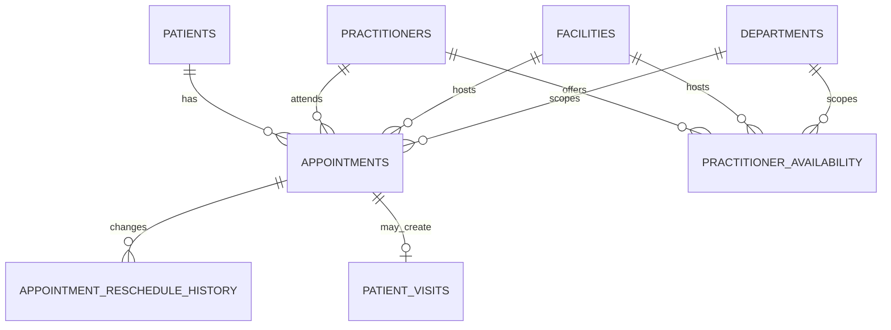
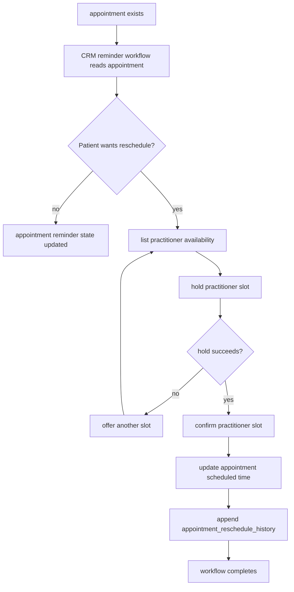

# Scheduling Schema Documentation

## Overview

This section defines the **scheduling domain** for the organizational health management system.

The design goal is to keep scheduling as canonical shared business truth instead of letting workflows, calls, or CRM-local state become the source of truth for booked time and slot inventory.

This domain is especially important because CRM reminder and reschedule workflows depend on it, but must not own it.

---

## Design Principles

### 1. Appointments are pre-encounter scheduling truth

An appointment is not the same thing as a patient visit.

Appointments must exist cleanly for booked, rescheduled, cancelled, no-show, and telemedicine cases even before a clinical encounter starts.

### 2. Availability must remain authoritative and shared

Bookable slot inventory must live in a canonical scheduling model.

It must not be reconstructed from CRM workflow state or hidden inside practitioner calendars without a durable shared contract.

### 3. Reschedule history should be append-only

Scheduling changes matter operationally and analytically.

The system should preserve the time-change trail rather than mutating away the old value with no durable history.

### 4. CRM may drive scheduling actions, but should not own scheduling truth

CRM can request slot listing, hold, confirm, and release through a service boundary.

The scheduling domain remains the owner of the resulting appointment and slot state.

---

# Table Definitions

## 1. `appointments`

### What it stores

Scheduled care interactions between patients and practitioners.

### Fields

| Field | Description |
|---|---|
| `id` | Unique appointment identifier |
| `organization_id` | Organization that owns the appointment |
| `facility_id` | Facility where the appointment is scheduled |
| `department_id` | Optional department scope |
| `patient_id` | Patient the appointment is for |
| `practitioner_id` | Practitioner assigned to the appointment |
| `appointment_number` | Internal appointment identifier |
| `appointment_type` | Type such as `consultation`, `followup`, `lab_review`, or `telemedicine` |
| `scheduled_for` | Planned appointment timestamp |
| `duration_minutes` | Planned duration |
| `status` | Status such as `scheduled`, `confirmed`, `rescheduled`, `completed`, `cancelled`, or `no_show` |
| `visit_mode` | Mode such as `in_person`, `telemedicine_video`, or `telemedicine_voice` |
| `chief_complaint` | Optional presenting reason |
| `notes` | Optional operational scheduling notes |
| `created_at` | Timestamp when the appointment was created |
| `updated_at` | Timestamp when the appointment was last updated |

### Important note

This table is the canonical appointment truth.
CRM reminder workflows should reference it and may request status or reminder-state updates through contract operations, but should not maintain a shadow appointment table.

---

## 2. `appointment_reschedule_history`

### What it stores

Append-only history of appointment time changes.

### Fields

| Field | Description |
|---|---|
| `id` | Unique reschedule history identifier |
| `appointment_id` | Appointment whose schedule changed |
| `previous_scheduled_for` | Previous appointment timestamp |
| `new_scheduled_for` | New appointment timestamp |
| `reason` | Optional reason for the change |
| `triggered_by` | User, system, or workflow that initiated the reschedule |
| `created_at` | Timestamp when the history row was created |

---

## 3. `practitioner_availability`

### What it stores

Bookable slot inventory for practitioners across facilities and departments.

### Fields

| Field | Description |
|---|---|
| `id` | Unique availability slot identifier |
| `organization_id` | Organization that owns the slot |
| `facility_id` | Facility where the slot is offered |
| `department_id` | Optional department scope |
| `practitioner_id` | Practitioner who owns the slot |
| `appointment_type` | Appointment type allowed in the slot |
| `visit_mode` | Supported visit mode such as `in_person` or `telemedicine_video` |
| `starts_at` | Slot start timestamp |
| `ends_at` | Slot end timestamp |
| `status` | Status such as `available`, `held`, `booked`, `blocked`, or `expired` |
| `held_until` | Optional hold-expiry timestamp |
| `held_by_reference` | Optional workflow or operation reference holding the slot |
| `created_at` | Timestamp when the slot was created |
| `updated_at` | Timestamp when the slot was last updated |

### Important note

The presence of `held` state exists so the service layer can implement safe hold-to-confirm transitions.
The authoritative hold and confirm logic still belongs to the scheduling service boundary, not to CRM-side fetch-modify-write logic.

---

# Relationship Summary

* One `patient` can have many `appointments`
* One `practitioner` can have many `appointments`
* One `appointment` can have many `appointment_reschedule_history` rows
* One `practitioner` can have many `practitioner_availability` slots

## CRM interaction rules

* CRM reminder workflows may read `appointments` and request reminder-state updates
* CRM reschedule workflows may list slots and request hold, confirm, or release operations
* CRM must not treat slot inventory cached in workflow state as authoritative

---

# Mermaid ER Diagram

---

# Sample Scheduling Flow

This sample flow shows how scheduling stays authoritative even when CRM initiates reminder or reschedule work.

---

# Example Lifecycle

## Step 1: Appointment is the scheduling anchor

An `appointment` is created for a `patient` and `practitioner`.
This record exists before any visit starts and remains the source of truth for scheduled care.

## Step 2: CRM may read scheduling truth

CRM reminder workflows can read the appointment and its current status, but they do not become the owner of that data.

## Step 3: Availability remains shared and authoritative

If rescheduling is needed, candidate times are read from `practitioner_availability`.
Those slots are shared resources and must not be managed from CRM-local state.

## Step 4: Reschedule operations must be safe

The service layer should hold a slot, confirm it, and then update the appointment without allowing concurrent workflows to book the same slot.

## Step 5: History is preserved

Every appointment time change should create an `appointment_reschedule_history` row so the prior schedule is not silently lost.

---

# Review Notes

Reject a scheduling design if it:

- stores bookable truth only inside CRM workflow state
- allows slot booking through non-atomic fetch-modify-write behavior
- merges appointments and visits into one record family
- treats telemedicine as only a CRM call concern instead of a scheduling concern plus a telemedicine-session concern
