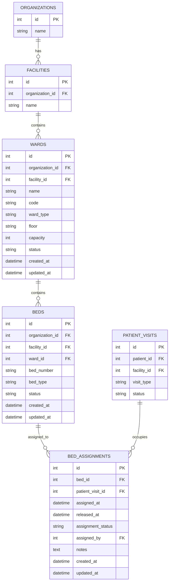
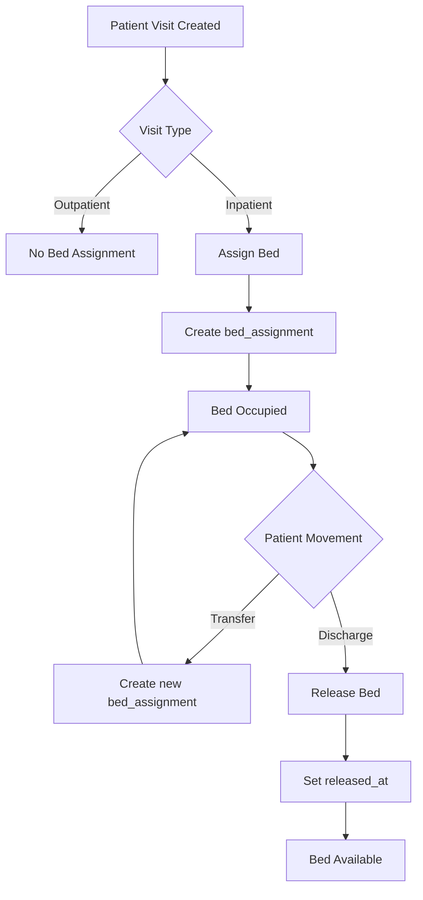

# Wards & Beds Schema Documentation

## Overview

This section defines the **ward and bed management domain** for the organizational health management system.

The design supports:

* multi-facility hospital structures
* inpatient admissions (IPD)
* bed allocation and reassignment
* occupancy tracking over time
* auditability of patient-bed relationships

The key design principle is that **bed occupancy is time-based**, so it is modeled using a separate assignment table rather than embedding patient references directly on beds.

---

## Design Principles

### 1. Wards belong to facilities

Each ward is scoped to a facility, ensuring support for multi-branch organizations.

### 2. Beds belong to wards

Each bed exists within a specific ward.

### 3. Bed occupancy is dynamic

A bed can be occupied, vacated, reassigned, or transferred. Therefore, occupancy must be tracked separately.

### 4. Use assignment-based modeling

Instead of linking beds directly to patients, use a dedicated `bed_assignments` table to track occupancy over time.

---

# Table Definitions

## 1. `wards`

### What it stores

Represents a ward or unit within a facility.

Examples:

* Male Ward
* Female Ward
* Pediatric Ward
* ICU
* Maternity Ward

### Fields

| Field             | Description                                                        |
| ----------------- | ------------------------------------------------------------------ |
| `id`              | Unique identifier for the ward                                     |
| `organization_id` | Organization that owns the ward                                    |
| `facility_id`     | Facility the ward belongs to                                       |
| `name`            | Ward name                                                          |
| `code`            | Optional ward code                                                 |
| `ward_type`       | Type such as `general`, `icu`, `maternity`, `pediatric`, `private` |
| `floor`           | Floor or location identifier                                       |
| `capacity`        | Intended capacity of the ward                                      |
| `status`          | Status such as `active`, `inactive`, or `maintenance`              |
| `created_at`      | Timestamp when the ward was created                                |
| `updated_at`      | Timestamp when the ward was last updated                           |

### Notes

* `capacity` is for validation/reference but the real occupancy is derived from beds

---

## 2. `beds`

### What it stores

Represents individual beds within a ward.

### Fields

| Field             | Description                                            |
| ----------------- | ------------------------------------------------------ |
| `id`              | Unique identifier for the bed                          |
| `organization_id` | Organization that owns the bed                         |
| `facility_id`     | Facility the bed belongs to                            |
| `ward_id`         | Ward the bed belongs to                                |
| `bed_number`      | Identifier within the ward                             |
| `bed_type`        | Type such as `general`, `icu`, `ventilated`, `private` |
| `status`          | Status such as `active`, `inactive`, or `maintenance`  |
| `created_at`      | Timestamp when the bed was created                     |
| `updated_at`      | Timestamp when the bed was last updated                |

### Important Note

Beds do NOT store `patient_visit_id`. Occupancy is tracked separately using assignments.

---

## 3. `bed_assignments`

### What it stores

Tracks which patient visit is assigned to which bed over time.

This table is responsible for modeling:

* admissions
* transfers
* discharges
* occupancy history

### Fields

| Field               | Description                                             |
| ------------------- | ------------------------------------------------------- |
| `id`                | Unique identifier for the assignment                    |
| `bed_id`            | Bed being assigned                                      |
| `patient_visit_id`  | Visit occupying the bed                                 |
| `assigned_at`       | Timestamp when the bed was assigned                     |
| `released_at`       | Timestamp when the bed was released                     |
| `assignment_status` | Status such as `active`, `transferred`, or `discharged` |
| `assigned_by`       | Staff member who made the assignment                    |
| `notes`             | Optional notes                                          |
| `created_at`        | Timestamp when the assignment was created               |
| `updated_at`        | Timestamp when the assignment was last updated          |

### Key Insight

A bed can have many assignments over time, but only one active assignment at a time.

---

# Relationship Summary

* A facility can have many wards
* A ward can have many beds
* A bed can have many assignments over time
* A patient visit can have many bed assignments (for transfers)

### Relationship Notes

#### `wards -> beds`

Each ward contains multiple beds.

#### `beds -> bed_assignments`

A bed may be assigned multiple times across different visits or over time.

#### `patient_visits -> bed_assignments`

A visit may involve multiple bed assignments due to transfers.

---

# Mermaid ER Diagram

---

# Workflow Flow Diagram

---

# Practical Workflow Interpretation

## Step 1: Patient visit is created

An inpatient visit is registered in `patient_visits`.

## Step 2: Bed is assigned

A new record is created in `bed_assignments` linking the visit to a bed.

## Step 3: Patient occupies bed

The bed is considered occupied while `released_at` is null.

## Step 4: Patient transfer (optional)

If the patient is moved to another ward or bed, a new `bed_assignments` record is created.

## Step 5: Patient discharge

The current assignment is closed by setting `released_at`.

## Step 6: Bed becomes available

The bed is free for reassignment.

---

# Future Extensions

This model can be extended with:

* bed reservations for planned admissions
* admission/discharge tables for inpatient lifecycle
* ward staffing assignments
* bed cleaning and maintenance logs
* occupancy dashboards and analytics

These can be added without modifying the core schema.
