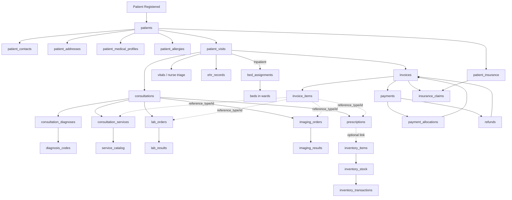

# Organizational Health Management System — Database Technical Specification

This document is the consolidated technical specification for the database layer of the Organizational Health Management System. It merges the previously separate schema documents (organizational foundation, user/access/workforce, clinical workflow, ward management, inventory, and billing/finance) into a single reference.

Each table is defined **once** in its canonical domain. Relationships that span domains (for example, `prescriptions` referencing `inventory_items`, or `invoice_items` referencing clinical workflow records) are wired up explicitly in section 12 ("Cross-Domain Relationships") and in the unified ER diagram.

---

# 1. Design Intent

The schema is designed for a multi-tenant organizational health management platform that can support:

- organizations operating a single facility
- organizations operating multiple branches/facilities
- facility-specific departments, wards, and inventory stores
- organization-specific access control and staffing structures
- reusable facility-defined shifts and date-specific staff assignments
- separation of long-lived patient identity from visit-specific clinical workflow
- configurable inventory engine that models pharmacies, lab stores, laundry stores, and general warehouses under a single stable model
- billing/finance that cleanly separates charges from payments and supports partial payments, refunds, and insurance claims

---

# 2. Core Design Principles

## 2.1 Organizational structure
- Every domain record is scoped to an organization (directly or transitively).
- Facilities can be nested via `parent_facility_id` for hierarchical branch structures.

## 2.2 Access control
- Users and roles use a **many-to-many** model through `user_roles`; there is no `role_id` on `users`.
- Permissions are feature-scoped and attached to roles.
- Facility access is granted through a separate `user_facilities` table.

## 2.3 Clinical workflow
- **Separate baseline patient data from visit data.** A patient exists across time; consultations, vitals, lab orders, and prescriptions happen during a specific visit.
- **`patient_visits` is the encounter anchor.** Most clinical workflow records attach to a visit, not directly to the patient.
- **Separate diagnosis from services rendered.** Diagnosis codes describe conditions; services represent actions performed and connect to billing.
- **Keep clinically important structured data separate.** For example, allergies are in their own table, not buried in a summary field.

## 2.4 Consent and contactability
- **Keep consent history append-only.** Each consent change creates a new `consent_records` row rather than mutating old rows.
- **Expose current consent truth directly.** Operational systems such as CRM should read the latest consent state from a current-state projection or equivalent direct lookup, not reconstruct it by scanning history rows.
- **Do not let outreach systems own consent truth.** CRM and similar services consume current consent state but do not author canonical consent records.

## 2.5 Ward & bed management
- Bed occupancy is **time-based** and modeled in a dedicated `bed_assignments` table. Beds do not store patient references directly.

## 2.6 Inventory
- **Fixed operational core** — stock-in, issue-out, transfer, adjustment, reorder checks, optional batch tracking, optional expiry tracking.
- **Configurable business vocabulary** — a pharmacy, laundry store, lab reagent store, or central warehouse are all modeled as `inventory_units` with different `inventory_type` values.
- **Hybrid model** — structured core tables with room for optional custom field extensions later.

## 2.7 Billing & finance
- **Separate charges from payments.** An invoice represents what is owed; a payment represents money actually received.
- **Support partial payments.** A single invoice can have many payments via `payment_allocations`.
- **Tie invoice items back to operational sources** (consultation services, lab orders, imaging orders, prescriptions) via `reference_type` + `reference_id`.
- **Keep insurance claims separate from payments.**

---

# 3. Organizational Foundation

## 3.1 `organizations`

Top-level tenant/customer entity using the platform.

| Field | Purpose |
|---|---|
| `id` | Unique identifier for the organization |
| `name` | Official name of the organization |
| `code` | Short unique code for the organization |
| `organization_type` | Type/category of organization (e.g. hospital group, clinic network, diagnostic provider) |
| `status` | Current state of the organization (e.g. active, inactive) |
| `created_at` | Timestamp when the organization record was created |
| `updated_at` | Timestamp when the organization record was last updated |

---

## 3.2 `facilities`

Represents a physical or operational branch/site under an organization.

| Field | Purpose |
|---|---|
| `id` | Unique identifier for the facility |
| `organization_id` | Organization that owns this facility |
| `parent_facility_id` | Optional reference to a parent facility for hierarchical facility structures |
| `name` | Name of the facility/branch |
| `code` | Short unique code for the facility |
| `facility_type` | Type of facility (e.g. hospital, clinic, lab, imaging center) |
| `address` | Physical address of the facility |
| `city` | City where the facility is located |
| `region` | Region/state/province of the facility |
| `country` | Country where the facility is located |
| `status` | Current operational status of the facility |
| `created_at` | Timestamp when the facility record was created |
| `updated_at` | Timestamp when the facility record was last updated |

---

## 3.3 `departments`

Operational units within a facility.

| Field | Purpose |
|---|---|
| `id` | Unique identifier for the department |
| `facility_id` | Facility this department belongs to |
| `name` | Name of the department |
| `code` | Short code for the department |
| `department_type` | Category/type of department (e.g. OPD, radiology, pharmacy, ICU) |
| `status` | Current status of the department |
| `created_at` | Timestamp when the department record was created |
| `updated_at` | Timestamp when the department record was last updated |

---

# 4. Identity & Access Control

## 4.1 `users`

Authentication and identity table for accounts that can access the system.

| Field | Purpose |
|---|---|
| `id` | Unique identifier for the user |
| `organization_id` | Organization the user belongs to |
| `first_name` | User's first name |
| `last_name` | User's last name |
| `email` | User's email address used for identification/login |
| `phone` | User's phone number |
| `password_hash` | Securely hashed password |
| `account_type` | Type of account (e.g. HUMAN, SERVICE) |
| `status` | Account status (e.g. active, suspended, invited, disabled) |
| `last_login_at` | Timestamp of the user's most recent login |
| `created_at` | Timestamp when the user record was created |
| `updated_at` | Timestamp when the user record was last updated |

> Note: a many-to-many user-role model is used through `user_roles`, so there is no `role_id` field on `users`.

---

## 4.2 `roles`

Access control roles defined for an organization.

| Field | Purpose |
|---|---|
| `id` | Unique identifier for the role |
| `organization_id` | Organization that owns or defines the role |
| `name` | Human-readable role name |
| `code` | Short machine-friendly role code |
| `description` | Description of what the role represents |
| `is_system_role` | Indicates whether the role is a default/system-provided role |
| `created_at` | Timestamp when the role was created |
| `updated_at` | Timestamp when the role was last updated |

---

## 4.3 `permissions`

Feature-level permissions attached to roles.

| Field | Purpose |
|---|---|
| `id` | Unique identifier for the permission record |
| `role_id` | Role this permission belongs to |
| `feature` | Functional area or feature the permission applies to |
| `can_read` | Whether the role can read/view this feature |
| `can_create` | Whether the role can create records in this feature |
| `can_update` | Whether the role can update records in this feature |
| `can_delete` | Whether the role can delete records in this feature |
| `created_at` | Timestamp when the permission record was created |
| `updated_at` | Timestamp when the permission record was last updated |

---

## 4.4 `user_roles`

Join table linking users to one or more roles.

| Field | Purpose |
|---|---|
| `id` | Unique identifier for the user-role assignment |
| `user_id` | User receiving the role |
| `role_id` | Role assigned to the user |
| `assigned_at` | Timestamp when the role was assigned |
| `assigned_by` | User who assigned the role |

---

## 4.5 `user_facilities`

Defines which facilities a user can access.

| Field | Purpose |
|---|---|
| `id` | Unique identifier for the user-facility access record |
| `user_id` | User being granted facility access |
| `facility_id` | Facility the user can access |
| `access_type` | Type of access relationship (e.g. primary, secondary) |
| `assigned_at` | Timestamp when access was granted |
| `assigned_by` | User who granted the access |

---

## 4.6 `user_sessions`

Tracks active and historical login sessions for users.

| Field | Purpose |
|---|---|
| `id` | Unique identifier for the session |
| `user_id` | User this session belongs to |
| `session_token` | Session token identifier |
| `refresh_token` | Refresh token associated with the session |
| `ip_address` | IP address from which the session was created or used |
| `user_agent` | Client/device information for the session |
| `started_at` | Timestamp when the session began |
| `expires_at` | Timestamp when the session expires |
| `last_active_at` | Timestamp of the most recent session activity |
| `revoked_at` | Timestamp when the session was revoked, if applicable |
| `revoke_reason` | Reason the session was revoked |

---

# 5. Workforce, Practitioners & Scheduling

## 5.1 `staff`

Employment/workforce profile table linked to a user account.

| Field | Purpose |
|---|---|
| `id` | Unique identifier for the staff record |
| `user_id` | User account associated with this staff profile |
| `organization_id` | Organization employing this staff member |
| `primary_facility_id` | Main facility where the staff member works |
| `primary_department_id` | Main department where the staff member works |
| `staff_number` | Organization-specific staff/employee number |
| `job_title` | Operational or HR title of the staff member |
| `employment_status` | Employment state (e.g. active, suspended, terminated, on_leave) |
| `hired_at` | Date/time the staff member was hired |
| `created_at` | Timestamp when the staff record was created |
| `updated_at` | Timestamp when the staff record was last updated |

---

## 5.2 `practitioners`

Canonical provider identity used for clinical care delivery, scheduling, telemedicine, and external interoperability. A practitioner may be backed by an internal `staff` record, but the practitioner model is intentionally separate so the system can also represent external consultants, visiting specialists, and EHR-synced providers who are not modeled as employees.

| Field | Purpose |
|---|---|
| `id` | Unique identifier for the practitioner record |
| `organization_id` | Organization the practitioner belongs to |
| `staff_id` | Optional staff profile linked to this practitioner |
| `external_practitioner_id` | Optional external/EHR provider reference |
| `practitioner_code` | Internal practitioner/provider code |
| `display_name` | Name shown to patients and staff |
| `first_name` | Structured first name where required |
| `last_name` | Structured last name where required |
| `provider_type` | Type such as `doctor`, `nurse_practitioner`, `physician_assistant`, or `therapist` |
| `specialty` | Specialty or clinical focus area |
| `license_number` | Optional professional license identifier |
| `telemedicine_enabled` | Whether this practitioner may be scheduled for telemedicine workflows |
| `status` | Operational state such as `active`, `inactive`, or `suspended` |
| `created_at` | Timestamp when the practitioner record was created |
| `updated_at` | Timestamp when the practitioner record was last updated |

> Recommended uniqueness constraints: `(organization_id, practitioner_code)` and `(organization_id, external_practitioner_id)` when the optional value is present. Recommended rule: `staff_id` should be unique when present so one internal staff profile does not back multiple practitioner identities unintentionally.

---

## 5.3 `practitioner_facilities`

Many-to-many scope table linking practitioners to the facilities and optional departments where they practice.

| Field | Purpose |
|---|---|
| `id` | Unique identifier for the practitioner-facility assignment |
| `practitioner_id` | Practitioner assigned to the facility |
| `facility_id` | Facility where the practitioner practices |
| `department_id` | Optional department scope within the facility |
| `is_primary` | Whether this is the practitioner's primary working location |
| `status` | Assignment status such as `active` or `inactive` |
| `created_at` | Timestamp when the assignment was created |
| `updated_at` | Timestamp when the assignment was last updated |

> Recommended uniqueness constraint: `(practitioner_id, facility_id, department_id)`.

---

## 5.4 `shifts`

Reusable facility-defined shift templates/definitions.

| Field | Purpose |
|---|---|
| `id` | Unique identifier for the shift definition |
| `facility_id` | Facility that owns the shift |
| `department_id` | Department the shift is associated with |
| `name` | Human-readable name of the shift |
| `start_time` | Shift start time (time-only, since this is a reusable definition) |
| `end_time` | Shift end time (time-only) |
| `shift_type` | Type of shift (e.g. day, night, on_call) |
| `created_by` | User who created the shift definition |
| `created_at` | Timestamp when the shift was created |
| `updated_at` | Timestamp when the shift was last updated |

> Note: `shifts` does not include a status field because it represents reusable facility-defined shifts, not one-time shift occurrences.

---

## 5.5 `shift_assignments`

Date-specific staff assignments to reusable shifts.

| Field | Purpose |
|---|---|
| `id` | Unique identifier for the shift assignment |
| `shift_id` | Shift definition being assigned |
| `staff_id` | Staff member assigned to the shift |
| `assignment_role` | Staff function within the shift (e.g. lead_doctor, support_nurse) |
| `assignment_date` | Date on which the assignment applies |
| `assigned_by` | User who made the assignment |
| `created_at` | Timestamp when the assignment was created |
| `updated_at` | Timestamp when the assignment was last updated |

> Recommended uniqueness constraint: `(shift_id, staff_id, assignment_date)`.

---

# 6. Patient Domain

## 6.1 `patients`

The long-lived identity and demographic record for a patient. Represents the patient as a person in the system and does not contain visit-specific data.

| Field | Description |
|---|---|
| `id` | Unique identifier for the patient |
| `organization_id` | Organization the patient record belongs to |
| `patient_number` | Internal patient identifier used by the organization |
| `first_name` | Patient's first name |
| `last_name` | Patient's last name |
| `middle_name` | Optional middle name |
| `date_of_birth` | Patient's date of birth |
| `sex` | Sex recorded for the patient |
| `marital_status` | Marital status |
| `national_id` | Optional government or national ID |
| `occupation` | Patient's occupation |
| `employer_name` | Optional employer information |
| `status` | Record status such as `active`, `inactive`, or `deceased` |
| `created_at` | Timestamp when the record was created |
| `updated_at` | Timestamp when the record was last updated |

---

## 6.2 `patient_contacts`

Contact methods for a patient such as phone numbers and email addresses. Supports multiple contact methods per patient.

| Field | Description |
|---|---|
| `id` | Unique identifier for the contact record |
| `patient_id` | Patient the contact belongs to |
| `contact_type` | Type such as `phone` or `email` |
| `value` | The actual contact value |
| `is_primary` | Indicates whether this is the primary contact method |
| `created_at` | Timestamp when the contact was created |
| `updated_at` | Timestamp when the contact was last updated |

---

## 6.3 `patient_addresses`

Addresses associated with the patient. A patient may have more than one address, such as home and work.

| Field | Description |
|---|---|
| `id` | Unique identifier for the address record |
| `patient_id` | Patient the address belongs to |
| `address_type` | Type such as `home`, `work`, or `other` |
| `line_1` | Main address line |
| `line_2` | Secondary address line |
| `city` | City or town |
| `region` | Region or state |
| `country` | Country |
| `postal_code` | Postal or ZIP code |
| `is_primary` | Indicates whether this is the primary address |
| `created_at` | Timestamp when the address was created |
| `updated_at` | Timestamp when the address was last updated |

---

## 6.4 `patient_insurance`

Insurance details associated with a patient. Supports one or more insurance records depending on business rules.

| Field | Description |
|---|---|
| `id` | Unique identifier for the insurance record |
| `patient_id` | Patient the insurance belongs to |
| `provider_name` | Insurance provider name |
| `policy_number` | Policy or membership number |
| `subscriber_name` | Name of the primary subscriber if different from the patient |
| `subscriber_relationship` | Relationship of patient to subscriber |
| `coverage_start` | Coverage start date |
| `coverage_end` | Coverage end date |
| `verified` | Whether the insurance has been verified |
| `created_at` | Timestamp when the insurance record was created |
| `updated_at` | Timestamp when the insurance record was last updated |

---

## 6.5 `patient_medical_profiles`

The patient's baseline clinical summary that is not tied to one specific visit. Meant for standing summary information clinicians may want to see across encounters.

| Field | Description |
|---|---|
| `id` | Unique identifier for the medical profile |
| `patient_id` | Patient this profile belongs to |
| `blood_group` | Patient blood group |
| `genotype` | Patient genotype if used by the organization |
| `primary_language` | Preferred language |
| `special_needs` | Accessibility or special care needs |
| `chronic_conditions_summary` | Summary of chronic conditions |
| `past_medical_history_summary` | Summary of prior medical history |
| `family_history_summary` | Summary of relevant family history |
| `surgical_history_summary` | Summary of past surgeries |
| `current_medications_summary` | Summary of long-term medications |
| `notes` | Additional general notes |
| `updated_at` | Timestamp when the profile was last updated |

> Note: this is not the main home for allergies, consultation notes, lab results, or prescriptions.

---

## 6.6 `patient_allergies`

Structured allergy records for a patient. Separated from the general medical profile so allergies can be clearly queried and highlighted in clinical workflows.

| Field | Description |
|---|---|
| `id` | Unique identifier for the allergy record |
| `patient_id` | Patient the allergy belongs to |
| `allergen` | Substance causing the allergy |
| `allergy_type` | Type such as `drug`, `food`, `environmental`, or `other` |
| `reaction` | Observed or reported reaction |
| `severity` | Severity level |
| `noted_at` | Date/time the allergy was recorded |
| `noted_by` | User or clinician who recorded it |
| `status` | Status such as `active`, `inactive`, or `resolved` |
| `created_at` | Timestamp when the allergy record was created |
| `updated_at` | Timestamp when the allergy record was last updated |

---

## 6.7 `consent_records`

Append-only history of patient communication consent state. This supports auditability, compliance review, and exact reconstruction of how outreach permissions changed over time without making CRM or other consumers scan unrelated patient history fields.

| Field | Description |
|---|---|
| `id` | Unique identifier for the consent history record |
| `organization_id` | Organization the consent record belongs to |
| `patient_id` | Patient whose consent changed |
| `patient_contact_id` | Optional linked contact method when the consent applies to a specific `patient_contacts` row |
| `facility_id` | Optional facility context where the consent was captured |
| `phone_number` | Optional phone number when consent is specific to one contact channel |
| `voice_outbound_allowed` | Whether automated or workflow-driven voice outreach is allowed after this change |
| `sms_outbound_allowed` | Whether automated or workflow-driven SMS outreach is allowed after this change |
| `source` | Source such as `staff_entry`, `patient_portal`, `ehr_import`, `sms_reply`, or `automated_call` |
| `collected_by` | User, system, or integration that recorded the consent state |
| `effective_at` | Timestamp when this consent state took effect |
| `notes` | Optional exceptional notes only |
| `created_at` | Timestamp when the consent history row was created |

> Important note: `consent_records` should be append-only. Updating prior consent rows should be disallowed.

---

## 6.8 `patient_current_consent`

Current-state projection or direct-read table for the latest patient outreach consent. This exists to support strong-read operational checks without forcing consumers to compute current truth from `consent_records`.

| Field | Description |
|---|---|
| `patient_id` | Patient whose current consent state is represented |
| `organization_id` | Organization context |
| `patient_contact_id` | Optional linked contact method when current consent is channel-specific |
| `facility_id` | Optional primary facility context |
| `phone_number` | Optional phone-specific current state |
| `voice_outbound_allowed` | Current voice outreach permission |
| `sms_outbound_allowed` | Current SMS outreach permission |
| `source` | Source of the latest effective consent state |
| `effective_at` | Timestamp when the current state took effect |
| `updated_at` | Timestamp when the current-state projection was last refreshed |

> Important note: this table is a current-state access path, not the historical audit trail. The append-only source of truth for consent history remains `consent_records`.

---

# 7. Appointments & Availability

## 7.1 `appointments`

Scheduled care interaction between a patient and a practitioner. This is the scheduling anchor before a clinical encounter actually starts. An appointment may later produce a `patient_visit`, but the two are intentionally separate so the system can represent booked, rescheduled, cancelled, no-show, and telemedicine appointments without forcing them to exist as active visits.

| Field | Description |
|---|---|
| `id` | Unique identifier for the appointment |
| `organization_id` | Organization that owns the appointment |
| `facility_id` | Facility where the appointment is scheduled |
| `department_id` | Optional department context for the appointment |
| `patient_id` | Patient the appointment is for |
| `practitioner_id` | Practitioner scheduled for the appointment |
| `appointment_number` | Internal appointment identifier |
| `appointment_type` | Type such as `consultation`, `follow_up`, `procedure`, or `telemedicine` |
| `scheduled_for` | Scheduled start timestamp |
| `duration_minutes` | Planned duration of the appointment |
| `status` | State such as `scheduled`, `confirmed`, `rescheduled`, `cancelled`, `completed`, or `no_show` |
| `location_type` | Where the encounter will occur, such as `physical_room`, `telemedicine`, or `home_visit` |
| `location_details` | Structured or textual location details such as room name or virtual channel reference |
| `chief_complaint` | Optional reason for the appointment |
| `notes` | Scheduling notes visible to staff |
| `patient_visit_id` | Optional linked visit once the appointment is checked in or fulfilled |
| `created_by` | User who created the appointment |
| `created_at` | Timestamp when the appointment was created |
| `updated_at` | Timestamp when the appointment was last updated |

> Recommended uniqueness constraint: `(organization_id, appointment_number)`. Recommended operational index: `(facility_id, scheduled_for, status)`.

---

## 7.2 `appointment_reschedule_history`

Append-only audit trail of appointment time changes. This avoids mutating or overwriting prior scheduling history and supports downstream reporting on reschedules and no-show patterns.

| Field | Description |
|---|---|
| `id` | Unique identifier for the reschedule history record |
| `appointment_id` | Appointment whose time changed |
| `previous_scheduled_for` | Prior scheduled timestamp |
| `new_scheduled_for` | New scheduled timestamp |
| `reason` | Optional reason for the reschedule |
| `triggered_by` | User, system, or workflow that initiated the change |
| `created_at` | Timestamp when the history record was created |

> Important note: this table should be append-only. A reschedule creates a new history row rather than editing prior history.

---

## 7.3 `practitioner_availability`

Bookable practitioner slot inventory used for appointment search, rescheduling, and telemedicine scheduling. This model is designed to support atomic hold and confirm semantics later at the service-contract layer.

| Field | Description |
|---|---|
| `id` | Unique identifier for the availability slot |
| `organization_id` | Organization that owns the slot |
| `facility_id` | Facility where the slot is offered |
| `department_id` | Optional department scope |
| `practitioner_id` | Practitioner offering the slot |
| `appointment_type` | Appointment type this slot can accept |
| `starts_at` | Slot start timestamp |
| `ends_at` | Slot end timestamp |
| `duration_minutes` | Slot duration in minutes |
| `status` | State such as `available`, `held`, `booked`, or `unavailable` |
| `held_by_reference_type` | Optional holder type such as `conversation` or `workflow` |
| `held_by_reference_id` | Optional holder identifier |
| `held_until` | Hold expiry timestamp when the slot is temporarily reserved |
| `external_slot_id` | Optional external/EHR slot identifier |
| `source` | Source such as `ehr_sync`, `manual`, or `system_generated` |
| `synced_at` | Last synchronization timestamp if the slot came from an upstream system |
| `created_at` | Timestamp when the slot record was created |
| `updated_at` | Timestamp when the slot was last updated |

> Recommended uniqueness constraint: `(organization_id, practitioner_id, starts_at, ends_at)`. Critical rule: only one workflow may hold or confirm a currently available slot at a time.

---

# 8. Clinical Workflow

## 8.1 `patient_visits`

A single encounter or visit between a patient and the healthcare system. This is the main anchor for visit-specific workflow.

| Field | Description |
|---|---|
| `id` | Unique identifier for the visit |
| `patient_id` | Patient for the visit |
| `organization_id` | Organization where the visit occurred |
| `facility_id` | Facility where the visit occurred |
| `department_id` | Department handling the visit |
| `appointment_id` | Optional originating appointment for the visit |
| `visit_number` | Internal visit identifier |
| `visit_type` | Type such as `outpatient`, `inpatient`, or `emergency` |
| `status` | Workflow status such as `registered`, `triaged`, `in_consultation`, `completed`, or `cancelled` |
| `chief_complaint` | Main presenting complaint or reason for visit |
| `attending_staff_id` | Primary operationally responsible clinician or staff member |
| `referred_by` | Optional referral source |
| `check_in_time` | Visit check-in timestamp |
| `check_out_time` | Visit check-out timestamp |
| `created_at` | Timestamp when the visit record was created |
| `updated_at` | Timestamp when the visit record was last updated |

---

## 8.2 `vitals`

Nurse triage and vital sign measurements captured during a visit.

| Field | Description |
|---|---|
| `id` | Unique identifier for the vitals record |
| `patient_visit_id` | Visit the vitals belong to |
| `recorded_by` | User or clinician who captured the vitals |
| `blood_pressure_systolic` | Systolic blood pressure |
| `blood_pressure_diastolic` | Diastolic blood pressure |
| `heart_rate` | Heart rate |
| `respiratory_rate` | Respiratory rate |
| `temperature` | Body temperature |
| `oxygen_saturation` | Oxygen saturation level |
| `weight` | Patient weight |
| `height` | Patient height |
| `bmi` | Calculated BMI if stored |
| `pain_score` | Reported pain score |
| `recorded_at` | Timestamp when vitals were recorded |

---

## 8.3 `consultations`

The clinician consultation session that occurs during a visit. Represents the direct clinical assessment session between patient and practitioner.

| Field | Description |
|---|---|
| `id` | Unique identifier for the consultation |
| `patient_visit_id` | Visit the consultation belongs to |
| `practitioner_id` | Practitioner conducting the consultation |
| `consultation_type` | Type of consultation |
| `consultation_notes` | Narrative notes from the session |
| `assessment` | Clinical assessment summary |
| `plan` | Care plan after assessment |
| `started_at` | Start time of the consultation |
| `ended_at` | End time of the consultation |
| `created_at` | Timestamp when the consultation was created |
| `updated_at` | Timestamp when the consultation was last updated |

---

## 8.4 `ehr_records`

Generic clinical documentation entries created during a visit or consultation. Supports a variety of clinical note types without forcing all documentation into the consultation table.

| Field | Description |
|---|---|
| `id` | Unique identifier for the EHR record |
| `patient_visit_id` | Visit the record belongs to |
| `consultation_id` | Optional consultation associated with the record |
| `recorded_by` | User or clinician who created the record |
| `record_type` | Type such as `note`, `procedure_note`, `nursing_note`, `discharge_note`, or `referral_note` |
| `title` | Optional title for the entry |
| `content` | Main note or record content |
| `created_at` | Timestamp when the record was created |
| `updated_at` | Timestamp when the record was last updated |

---

## 8.5 `consultation_diagnoses`

Diagnosis records assigned during a consultation. Links the consultation session to structured diagnosis codes (see section 8.1).

| Field | Description |
|---|---|
| `id` | Unique identifier for the consultation diagnosis |
| `consultation_id` | Consultation where the diagnosis was assigned |
| `diagnosis_code_id` | Diagnosis code used |
| `diagnosis_type` | Type such as `primary`, `secondary`, or `differential` |
| `notes` | Optional notes about the diagnosis |
| `created_at` | Timestamp when the diagnosis link was created |

---

## 8.6 `consultation_services`

Services actually rendered during a consultation. Distinct from diagnosis; records what was done, how much, and at what cost. References the `service_catalog` (section 8.2).

| Field | Description |
|---|---|
| `id` | Unique identifier for the rendered service record |
| `consultation_id` | Consultation during which the service was rendered |
| `service_id` | Service rendered (FK → `service_catalog.id`) |
| `quantity` | Quantity of the service rendered |
| `unit_price` | Unit price applied at the time |
| `total_price` | Total price charged |
| `notes` | Optional notes |
| `created_at` | Timestamp when the record was created |

---

## 8.7 `lab_orders`

Laboratory test requests generated during a visit or consultation.

| Field | Description |
|---|---|
| `id` | Unique identifier for the lab order |
| `patient_visit_id` | Visit the lab order belongs to |
| `consultation_id` | Optional consultation that generated the order |
| `ordered_by` | Clinician who ordered the test |
| `test_name` | Name of the requested test |
| `service_id` | Optional service catalog reference |
| `priority` | Priority such as `routine`, `urgent`, or `stat` |
| `status` | Order status such as `ordered`, `sample_collected`, `processing`, `completed`, or `cancelled` |
| `clinical_notes` | Clinical context or ordering notes |
| `ordered_at` | Timestamp when the order was created |

---

## 8.8 `lab_results`

Laboratory test results associated with lab orders.

| Field | Description |
|---|---|
| `id` | Unique identifier for the lab result |
| `lab_order_id` | Lab order this result belongs to |
| `result_text` | Narrative or summary result |
| `result_data` | Structured result data if supported |
| `interpretation` | Clinical interpretation |
| `abnormal_flag` | Indicates whether result is abnormal |
| `performed_by` | Staff member who performed the test |
| `verified_by` | Staff member who verified the result |
| `resulted_at` | Timestamp when result became available |
| `verified_at` | Timestamp when result was verified |

---

## 8.9 `imaging_orders`

Imaging requests generated during a visit or consultation. Examples: X-ray, ultrasound, CT, MRI.

| Field | Description |
|---|---|
| `id` | Unique identifier for the imaging order |
| `patient_visit_id` | Visit the imaging order belongs to |
| `consultation_id` | Optional consultation that generated the order |
| `ordered_by` | Clinician who ordered the imaging study |
| `imaging_type` | Type such as `xray`, `ultrasound`, `ct`, or `mri` |
| `study_name` | Name of the requested imaging study |
| `service_id` | Optional service catalog reference |
| `priority` | Priority level |
| `status` | Order status |
| `clinical_notes` | Clinical notes or indication |
| `ordered_at` | Timestamp when the order was created |

---

## 8.10 `imaging_results`

Result reports for completed imaging orders.

| Field | Description |
|---|---|
| `id` | Unique identifier for the imaging result |
| `imaging_order_id` | Imaging order this result belongs to |
| `report_text` | Full imaging report text |
| `impression` | Summary impression |
| `file_url` | Optional link to image/report file |
| `performed_by` | Staff member who performed the imaging study |
| `reported_by` | Staff member who authored the report |
| `resulted_at` | Timestamp when the result was produced |

---

## 8.11 `prescriptions`

Medication prescriptions generated during a visit or consultation. Optionally connects to the inventory system via `inventory_item_id` (section 10.3).

| Field | Description |
|---|---|
| `id` | Unique identifier for the prescription record |
| `patient_visit_id` | Visit the prescription belongs to |
| `consultation_id` | Consultation that generated the prescription |
| `prescribed_by` | Clinician who prescribed the medication |
| `medication_name` | Name of the medication |
| `inventory_item_id` | Optional linked inventory item (FK → `inventory_items.id`) |
| `dosage` | Dosage information |
| `route` | Route of administration |
| `frequency` | Frequency of use |
| `duration` | Duration of the prescription |
| `quantity` | Quantity prescribed |
| `instructions` | Additional patient instructions |
| `status` | Prescription status |
| `created_at` | Timestamp when the prescription was created |
| `updated_at` | Timestamp when the prescription was last updated |

---

# 9. Clinical Catalogs

## 9.1 `diagnosis_codes`

The diagnosis code catalog used by the organization. May support ICD-based codes and local extensions.

| Field | Description |
|---|---|
| `id` | Unique identifier for the diagnosis code entry |
| `code` | Diagnosis code value |
| `code_system` | Code system such as `ICD-10`, `ICD-11`, or `local` |
| `title` | Short diagnosis title |
| `description` | Longer diagnosis description |
| `status` | Availability status |
| `created_at` | Timestamp when the code entry was created |
| `updated_at` | Timestamp when the code entry was last updated |

---

## 9.2 `service_catalog`

The organization's catalog of clinical or operational services that can be rendered and potentially billed. Examples: consultation fees, dressings, tests, procedures, imaging services.

| Field | Description |
|---|---|
| `id` | Unique identifier for the service |
| `organization_id` | Organization that owns the service catalog entry |
| `department_id` | Optional department associated with the service |
| `service_code` | Internal service code |
| `name` | Service name |
| `description` | Description of the service |
| `base_price` | Default price for the service |
| `status` | Service status such as `active` or `inactive` |
| `created_at` | Timestamp when the service was created |
| `updated_at` | Timestamp when the service was last updated |

---

# 10. Ward & Bed Management

## 10.1 `wards`

Represents a ward or unit within a facility. Examples: Male Ward, Female Ward, Pediatric Ward, ICU, Maternity Ward.

| Field | Description |
|---|---|
| `id` | Unique identifier for the ward |
| `organization_id` | Organization that owns the ward |
| `facility_id` | Facility the ward belongs to |
| `name` | Ward name |
| `code` | Optional ward code |
| `ward_type` | Type such as `general`, `icu`, `maternity`, `pediatric`, `private` |
| `floor` | Floor or location identifier |
| `capacity` | Intended capacity of the ward |
| `status` | Status such as `active`, `inactive`, or `maintenance` |
| `created_at` | Timestamp when the ward was created |
| `updated_at` | Timestamp when the ward was last updated |

> Note: `capacity` is for validation/reference; real occupancy is derived from bed assignments.

---

## 10.2 `beds`

Represents individual beds within a ward.

| Field | Description |
|---|---|
| `id` | Unique identifier for the bed |
| `organization_id` | Organization that owns the bed |
| `facility_id` | Facility the bed belongs to |
| `ward_id` | Ward the bed belongs to |
| `bed_number` | Identifier within the ward |
| `bed_type` | Type such as `general`, `icu`, `ventilated`, `private` |
| `status` | Status such as `active`, `inactive`, or `maintenance` |
| `created_at` | Timestamp when the bed was created |
| `updated_at` | Timestamp when the bed was last updated |

> Important: beds do NOT store `patient_visit_id`. Occupancy is tracked separately in `bed_assignments`.

---

## 10.3 `bed_assignments`

Tracks which patient visit is assigned to which bed over time. Models admissions, transfers, discharges, and occupancy history.

| Field | Description |
|---|---|
| `id` | Unique identifier for the assignment |
| `bed_id` | Bed being assigned |
| `patient_visit_id` | Visit occupying the bed |
| `assigned_at` | Timestamp when the bed was assigned |
| `released_at` | Timestamp when the bed was released |
| `assignment_status` | Status such as `active`, `transferred`, or `discharged` |
| `assigned_by` | Staff member who made the assignment |
| `notes` | Optional notes |
| `created_at` | Timestamp when the assignment was created |
| `updated_at` | Timestamp when the assignment was last updated |

> Key insight: a bed can have many assignments over time, but only one active assignment at a time.

---

# 11. Inventory

The inventory model is a **configurable inventory engine**. A pharmacy, laundry store, lab reagent store, and central warehouse are all represented as `inventory_units` with different `inventory_type` values, using the same underlying stock and transaction tables.

## 11.1 `inventory_units`

A logical stock-holding unit, store, or inventory location within an organization or facility. Examples: Main Pharmacy, Emergency Store, Central Warehouse, Laundry Supplies, Lab Reagents Store.

| Field | Description |
|---|---|
| `id` | Unique identifier for the inventory unit |
| `organization_id` | Organization that owns the inventory unit |
| `facility_id` | Facility or branch where the inventory unit exists |
| `department_id` | Optional department scope if the inventory unit is department-specific |
| `name` | Display name of the inventory unit |
| `code` | Unique or semi-structured code for the inventory unit |
| `inventory_type` | Broad type such as `pharmacy`, `store`, `lab`, `laundry`, or `custom` |
| `description` | Optional explanation of the unit's purpose |
| `status` | Operational state such as `active` or `inactive` |
| `created_at` | Timestamp when the unit was created |
| `updated_at` | Timestamp when the unit was last updated |

---

## 11.2 `inventory_categories`

Item groupings used to classify inventory items. Examples: Drugs, Consumables, Reagents, Linens, Cleaning Supplies, Equipment Accessories.

| Field | Description |
|---|---|
| `id` | Unique identifier for the inventory category |
| `organization_id` | Organization that owns the category |
| `name` | Name of the category |
| `code` | Optional category code |
| `description` | Optional description of the category |
| `created_at` | Timestamp when the category was created |
| `updated_at` | Timestamp when the category was last updated |

---

## 11.3 `inventory_items`

The organization's master list of inventory items. This is the core item catalog and is not tied to one specific inventory unit — the same item can exist in multiple inventory units.

| Field | Description |
|---|---|
| `id` | Unique identifier for the inventory item |
| `organization_id` | Organization that owns the item definition |
| `category_id` | Category the item belongs to |
| `name` | Item name |
| `code` | Internal item code |
| `sku` | Stock keeping unit |
| `unit_of_measure` | Unit such as `tablet`, `capsule`, `piece`, `bottle` |
| `item_type` | Broad item type such as `drug`, `consumable`, `reagent`, `linen`, `custom` |
| `is_batch_tracked` | Indicates whether item batches are tracked |
| `is_expiry_tracked` | Indicates whether expiry dates are tracked |
| `reorder_level` | Threshold for low-stock alerts |
| `status` | Item status such as `active` or `inactive` |
| `created_at` | Timestamp when the item was created |
| `updated_at` | Timestamp when the item was last updated |

---

## 11.4 `inventory_stock`

Current stock balance of a particular inventory item within a specific inventory unit. Answers questions such as "How much Paracetamol is currently in Main Pharmacy?".

| Field | Description |
|---|---|
| `id` | Unique identifier for the stock balance row |
| `inventory_unit_id` | Inventory unit holding the stock |
| `inventory_item_id` | Item whose stock is being tracked |
| `quantity_on_hand` | Current available quantity physically present |
| `reserved_quantity` | Quantity reserved for pending use or allocation |
| `reorder_level_override` | Optional location-specific reorder threshold |
| `last_updated_at` | Timestamp of last stock balance update |

> Recommended uniqueness constraint: `(inventory_unit_id, inventory_item_id)` to prevent duplicate stock rows for the same item in the same unit.

---

## 11.5 `inventory_transactions`

Movement history of inventory items — explains how stock changed over time.

Transaction types include: `STOCK_IN`, `ISSUE_OUT`, `TRANSFER`, `ADJUSTMENT`, `RETURN`, `DISCARD`.

| Field | Description |
|---|---|
| `id` | Unique identifier for the transaction |
| `organization_id` | Organization that owns the transaction |
| `inventory_item_id` | Item involved in the transaction |
| `source_unit_id` | Inventory unit stock is coming from, if applicable |
| `destination_unit_id` | Inventory unit stock is going to, if applicable |
| `transaction_type` | Type of inventory movement |
| `quantity` | Quantity moved |
| `unit_cost` | Optional unit cost at the time of transaction |
| `batch_number` | Optional batch or lot number |
| `expiry_date` | Optional expiry date for tracked items |
| `reference_type` | Optional business reference type such as `purchase_order`, `prescription`, `adjustment_note` |
| `reference_id` | Optional identifier of the business reference |
| `performed_by` | User or staff member who performed or recorded the transaction |
| `notes` | Optional additional notes |
| `created_at` | Timestamp when the transaction was created |

### Interpreting source and destination

- `STOCK_IN`: `source_unit_id` may be `null`, `destination_unit_id` is populated
- `ISSUE_OUT`: `source_unit_id` is populated, `destination_unit_id` may be `null`
- `TRANSFER`: both `source_unit_id` and `destination_unit_id` are populated

---

# 12. Billing & Finance

## 12.1 `invoices`

The invoice header or billing document for a patient encounter. Represents the overall bill and summarizes financial totals for a patient visit.

| Field | Description |
|---|---|
| `id` | Unique identifier for the invoice |
| `organization_id` | Organization that owns the invoice |
| `facility_id` | Facility where the invoice was generated |
| `patient_id` | Patient being billed |
| `patient_visit_id` | Visit the invoice is associated with |
| `invoice_number` | Human-readable invoice number |
| `status` | Invoice status such as `draft`, `issued`, `partially_paid`, `paid`, `cancelled`, or `voided` |
| `subtotal_amount` | Sum of item amounts before discounts or tax |
| `discount_amount` | Total discounts applied to the invoice |
| `tax_amount` | Tax amount if applicable |
| `total_amount` | Final total invoice amount |
| `amount_paid` | Total amount paid so far |
| `amount_due` | Remaining unpaid balance |
| `currency` | Currency code such as `GHS` |
| `issued_at` | Timestamp when the invoice was issued |
| `due_at` | Optional payment due date |
| `created_at` | Timestamp when the invoice record was created |
| `updated_at` | Timestamp when the invoice record was last updated |

---

## 12.2 `invoice_items`

Line items that make up an invoice. Each record represents one charge component on the invoice (consultation fee, lab test charge, imaging charge, medication charge, procedure charge, etc.).

| Field | Description |
|---|---|
| `id` | Unique identifier for the invoice item |
| `invoice_id` | Invoice the line item belongs to |
| `item_type` | Broad type of billed item such as `service`, `lab`, `imaging`, `drug`, or `other` |
| `description` | Human-readable description of the charge |
| `reference_type` | Source record type such as `consultation_service`, `lab_order`, `imaging_order`, or `prescription` |
| `reference_id` | Identifier of the source record |
| `quantity` | Quantity billed |
| `unit_price` | Price per unit at the time of billing |
| `discount_amount` | Discount applied to this line item |
| `total_amount` | Final line total after discounts |
| `created_at` | Timestamp when the invoice item was created |
| `updated_at` | Timestamp when the invoice item was last updated |

> Note: `reference_type` + `reference_id` make billing traceable — each invoice line can be linked back to its source operational workflow record.

---

## 12.3 `payments`

Actual payment transactions received against invoices. A payment record represents money collection activity, not the invoice itself.

| Field | Description |
|---|---|
| `id` | Unique identifier for the payment |
| `organization_id` | Organization that owns the payment record |
| `facility_id` | Facility where the payment was received or recorded |
| `payment_reference` | Internal payment reference number |
| `amount` | Total payment amount received |
| `method` | Payment method such as `cash`, `card`, `mobile_money`, or `bank_transfer` |
| `status` | Payment status such as `pending`, `completed`, `failed`, `reversed`, or `refunded` |
| `transaction_id` | External payment gateway or banking transaction identifier if applicable |
| `received_by` | User or cashier who recorded the payment |
| `paid_at` | Timestamp when the payment was made or confirmed |
| `created_at` | Timestamp when the payment record was created |
| `updated_at` | Timestamp when the payment record was last updated |

> Note: this table is intentionally not directly tied to a single invoice — payments are mapped to invoices through `payment_allocations`, so a payment may be split across multiple invoices.

---

## 12.4 `payment_allocations`

Mapping between payments and invoices. Supports one invoice paid by multiple payments, one payment partly or fully allocated to an invoice, and (future) one payment covering multiple invoices.

| Field | Description |
|---|---|
| `id` | Unique identifier for the payment allocation |
| `payment_id` | Payment being allocated |
| `invoice_id` | Invoice receiving the allocation |
| `allocated_amount` | Portion of the payment allocated to the invoice |
| `created_at` | Timestamp when the allocation was created |

---

## 12.5 `refunds`

Refund records for money returned after a payment has already been received. Used when a facility needs to return money to a patient or payer due to overpayment, cancellation, billing error, duplicate payment, service non-delivery, or other financial correction.

| Field | Description |
|---|---|
| `id` | Unique identifier for the refund |
| `organization_id` | Organization that owns the refund record |
| `facility_id` | Facility where the refund originated |
| `payment_id` | Original payment the refund is tied to |
| `invoice_id` | Optional invoice affected by the refund |
| `refund_reference` | Internal refund reference number |
| `amount` | Amount refunded |
| `method` | Refund method such as `cash`, `card_reversal`, `mobile_money`, or `bank_transfer` |
| `status` | Refund status such as `pending`, `completed`, `failed`, `cancelled`, or `reversed` |
| `reason` | Reason for the refund |
| `processed_by` | User or staff member who processed the refund |
| `processed_at` | Timestamp when the refund was processed |
| `created_at` | Timestamp when the refund record was created |
| `updated_at` | Timestamp when the refund record was last updated |

> Note: a refund should be linked to the original payment so that returned money is traceable to the source collection event.

---

## 12.6 `insurance_claims`

Claims submitted to an insurer for charges related to a patient visit and invoice. Tracks the financial claim process independently from direct cash or gateway payments.

| Field | Description |
|---|---|
| `id` | Unique identifier for the insurance claim |
| `organization_id` | Organization that owns the claim |
| `facility_id` | Facility where the claim originated |
| `patient_id` | Patient associated with the claim |
| `patient_visit_id` | Visit the claim relates to |
| `invoice_id` | Invoice the claim is associated with |
| `patient_insurance_id` | Patient insurance record used for the claim (FK → `patient_insurance.id`) |
| `claim_number` | External or internal claim reference number |
| `status` | Claim status such as `draft`, `submitted`, `under_review`, `approved`, `partially_approved`, `rejected`, `paid`, or `closed` |
| `amount_claimed` | Total amount claimed from the insurer |
| `amount_approved` | Amount approved by the insurer |
| `amount_paid` | Amount actually paid by the insurer |
| `submitted_at` | Timestamp when the claim was submitted |
| `adjudicated_at` | Timestamp when claim review/adjudication completed |
| `paid_at` | Timestamp when insurer payment was received |
| `created_at` | Timestamp when the claim record was created |
| `updated_at` | Timestamp when the claim record was last updated |

---

# 13. System Tables

## 13.1 `audit_logs`

Immutable trace records for security, compliance, and activity tracking.

| Field | Purpose |
|---|---|
| `id` | Unique identifier for the audit log record |
| `organization_id` | Organization context of the event |
| `facility_id` | Facility context of the event, if applicable |
| `event_type` | High-level category of the event (e.g. AUTH, DATA_ACCESS, DATA_CHANGE, EXPORT) |
| `action` | Specific action performed (e.g. CREATE, UPDATE, DELETE, VIEW, LOGIN) |
| `entity_type` | Type of domain entity affected (e.g. patient, invoice, user, staff) |
| `entity_id` | ID of the specific entity affected |
| `actor_type` | Type of actor responsible for the event (e.g. USER, SYSTEM, SERVICE, INTEGRATION) |
| `actor_id` | Identifier of the actor responsible for the event |
| `request_id` | Request correlation ID for tracing across services |
| `session_id` | Session associated with the event |
| `ip_address` | IP address where the event originated |
| `user_agent` | Client/device making the request |
| `source_system` | System or service that initiated the action |
| `status` | Outcome of the event (e.g. SUCCESS, FAILED, DENIED) |
| `old_value` | Previous state of the affected data, stored as JSON |
| `new_value` | New state of the affected data, stored as JSON |
| `changed_fields` | JSON representation of fields changed |
| `created_at` | Timestamp when the audit log was recorded |

---

## 13.2 `notifications`

User-targeted system notifications.

| Field | Purpose |
|---|---|
| `id` | Unique identifier for the notification |
| `organization_id` | Organization context of the notification |
| `facility_id` | Facility context of the notification, if applicable |
| `user_id` | User receiving the notification |
| `type` | Notification type/category |
| `title` | Short notification title |
| `message` | Full notification content |
| `status` | Notification state (e.g. unread, read, archived, failed) |
| `read_at` | Timestamp when the notification was read |
| `created_at` | Timestamp when the notification was created |

---

# 14. Relationship Summary

## 14.1 Organizational structure
- One `organization` can have many `facilities`
- One `facility` can optionally be the child of another `facility` (`parent_facility_id`)
- One `facility` can have many `departments`

## 14.2 Access control
- One `organization` defines many `roles`
- One `role` has many `permissions`
- One `user` has many `roles` through `user_roles`
- One `user` has access to many `facilities` through `user_facilities`
- One `user` has many `user_sessions`

## 14.3 Workforce & scheduling
- One `organization` employs many `staff`
- One `user` may map to one `staff` profile
- One `staff` member has one `primary_facility` and one `primary_department`
- One `organization` defines many `practitioners`
- One `practitioner` may map to one `staff` profile
- One `practitioner` may practice at many `facilities` through `practitioner_facilities`
- One `patient` can have many `appointments`
- One `practitioner` can have many `appointments`
- One `appointment` can have many `appointment_reschedule_history` records
- One `practitioner` can have many `practitioner_availability` slots
- One `facility` defines many `shifts`; one `department` scopes many `shifts`
- One `staff` member has many `shift_assignments`; one `shift` has many `shift_assignments`

## 14.4 Patient domain
- One `organization` owns many `patients`
- One `patient` has many `patient_contacts`, `patient_addresses`, `patient_insurance`, `patient_allergies`, `consent_records`
- One `patient` has one (or versioned) `patient_medical_profiles`
- One `patient` may have one or more `patient_current_consent` projections depending on phone-specific modeling
- One `patient` has many `patient_visits`

## 14.5 Clinical workflow
- One `appointment` may produce one `patient_visit`
- One `patient_visit` has many `vitals`, `consultations`, `ehr_records`, `lab_orders`, `imaging_orders`, `prescriptions`
- One `practitioner` has many `consultations`
- One `consultation` has many `ehr_records`, `consultation_diagnoses`, `consultation_services`, `lab_orders`, `imaging_orders`, `prescriptions`
- One `lab_order` produces one or more `lab_results`
- One `imaging_order` produces one or more `imaging_results`
- `diagnosis_codes` are referenced by `consultation_diagnoses`
- `service_catalog` entries are referenced by `consultation_services`, `lab_orders`, and `imaging_orders`

## 14.6 Ward & bed management
- One `facility` contains many `wards`
- One `ward` contains many `beds`
- One `bed` has many `bed_assignments` over time (only one active at a time)
- One `patient_visit` may have many `bed_assignments` (admissions + transfers)

## 14.7 Inventory
- One `organization` owns many `inventory_units`, `inventory_categories`, `inventory_items`
- One `facility` contains many `inventory_units`; one `department` may optionally scope an `inventory_unit`
- One `inventory_category` groups many `inventory_items`
- One `inventory_unit` holds many `inventory_stock` rows
- One `inventory_item` appears in many `inventory_stock` rows (one per unit it is stored in)
- One `inventory_item` appears in many `inventory_transactions`
- One `inventory_unit` participates in many `inventory_transactions` as source or destination

## 14.8 Billing & finance
- One `patient_visit` can generate one or more `invoices`
- One `invoice` contains many `invoice_items`
- One `invoice` can receive many `payment_allocations`
- One `payment` can produce one or more `payment_allocations`
- One `payment` can have many `refunds`; one `invoice` may also be affected by refunds
- One `invoice` can have one or more `insurance_claims`
- One `patient_insurance` can be used by many `insurance_claims`

## 14.9 System
- `audit_logs` are scoped to organizations and optionally facilities
- `notifications` are scoped to organizations and optionally facilities, and are delivered to users

---

# 15. Cross-Domain Relationships

This section makes explicit the foreign key relationships that span domain boundaries. These are the links the individual domain documents only hinted at.

| From | Field | To | Notes |
|---|---|---|---|
| `appointments` | `patient_id` | `patients.id` | Appointment subject |
| `appointments` | `practitioner_id` | `practitioners.id` | Scheduled provider |
| `appointments` | `facility_id`, `department_id` | `facilities.id`, `departments.id` | Scheduling context |
| `appointment_reschedule_history` | `appointment_id` | `appointments.id` | Append-only schedule change trail |
| `practitioner_availability` | `practitioner_id` | `practitioners.id` | Slot owner |
| `practitioner_availability` | `facility_id`, `department_id` | `facilities.id`, `departments.id` | Slot context |
| `consent_records` | `patient_id` | `patients.id` | Append-only patient consent history |
| `consent_records` | `patient_contact_id` | `patient_contacts.id` | Optional channel-specific consent linkage |
| `patient_current_consent` | `patient_id` | `patients.id` | Current consent read path |
| `patient_current_consent` | `patient_contact_id` | `patient_contacts.id` | Optional current contact-specific consent linkage |
| `patient_visits` | `appointment_id` | `appointments.id` | Visit may originate from a scheduled appointment |
| `consultation_services` | `service_id` | `service_catalog.id` | Services rendered in a consultation reference the catalog |
| `lab_orders` | `service_id` | `service_catalog.id` | Optional billing link for lab tests |
| `imaging_orders` | `service_id` | `service_catalog.id` | Optional billing link for imaging studies |
| `consultation_diagnoses` | `diagnosis_code_id` | `diagnosis_codes.id` | Assigns a code catalog entry to a consultation |
| `prescriptions` | `inventory_item_id` | `inventory_items.id` | Optional link from clinical prescription to pharmacy stock |
| `inventory_units` | `facility_id` | `facilities.id` | Inventory stores live inside facilities |
| `inventory_units` | `department_id` | `departments.id` | Optional department scope for an inventory unit |
| `bed_assignments` | `patient_visit_id` | `patient_visits.id` | Connects inpatient visit to a bed |
| `invoices` | `patient_visit_id` | `patient_visits.id` | Invoices originate from visits |
| `invoice_items` | `reference_id` | polymorphic (`consultation_services`, `lab_orders`, `imaging_orders`, `prescriptions`) — resolved by `reference_type` | Traces billing lines back to clinical workflow |
| `insurance_claims` | `patient_insurance_id` | `patient_insurance.id` | Ties claim to the specific insurance policy used |
| `insurance_claims` | `invoice_id` | `invoices.id` | Claim is filed against a specific invoice |
| `insurance_claims` | `patient_visit_id` | `patient_visits.id` | Claim is scoped to the visit it relates to |
| `payments.received_by`, `refunds.processed_by`, `shift_assignments.assigned_by`, `user_roles.assigned_by`, `user_facilities.assigned_by`, `shifts.created_by`, `vitals.recorded_by`, `ehr_records.recorded_by`, `lab_results.performed_by`/`verified_by`, `imaging_results.performed_by`/`reported_by`, `prescriptions.prescribed_by`, `lab_orders.ordered_by`, `imaging_orders.ordered_by`, `bed_assignments.assigned_by`, `inventory_transactions.performed_by`, `patient_allergies.noted_by` | — | `users.id` (or `staff.id` where indicated) | Actor references |
| `practitioners.staff_id` | — | `staff.id` | Optional link from practitioner identity to internal workforce profile |
| `practitioner_facilities.facility_id`, `practitioner_facilities.department_id` | — | `facilities.id`, `departments.id` | Where the practitioner practices |
| `consultations.practitioner_id` | — | `practitioners.id` | Clinical provider conducting the consultation |
| `patient_visits.attending_staff_id` | — | `staff.id` | Operationally responsible staff member for the visit |

---

# 16. Unified ER Diagram

```mermaid
erDiagram
    %% ===== Organizational Foundation =====
    ORGANIZATIONS {
        int id PK
        string name
        string code
        string organization_type
        string status
        datetime created_at
        datetime updated_at
    }

    FACILITIES {
        int id PK
        int organization_id FK
        int parent_facility_id FK
        string name
        string code
        string facility_type
        string address
        string city
        string region
        string country
        string status
        datetime created_at
        datetime updated_at
    }

    DEPARTMENTS {
        int id PK
        int facility_id FK
        string name
        string code
        string department_type
        string status
        datetime created_at
        datetime updated_at
    }

    %% ===== Identity & Access =====
    USERS {
        int id PK
        int organization_id FK
        string first_name
        string last_name
        string email
        string phone
        string password_hash
        string account_type
        string status
        datetime last_login_at
        datetime created_at
        datetime updated_at
    }

    ROLES {
        int id PK
        int organization_id FK
        string name
        string code
        string description
        boolean is_system_role
        datetime created_at
        datetime updated_at
    }

    PERMISSIONS {
        int id PK
        int role_id FK
        string feature
        boolean can_read
        boolean can_create
        boolean can_update
        boolean can_delete
        datetime created_at
        datetime updated_at
    }

    USER_ROLES {
        int id PK
        int user_id FK
        int role_id FK
        datetime assigned_at
        int assigned_by FK
    }

    USER_FACILITIES {
        int id PK
        int user_id FK
        int facility_id FK
        string access_type
        datetime assigned_at
        int assigned_by FK
    }

    USER_SESSIONS {
        int id PK
        int user_id FK
        string session_token
        string refresh_token
        string ip_address
        string user_agent
        datetime started_at
        datetime expires_at
        datetime last_active_at
        datetime revoked_at
        string revoke_reason
    }

    %% ===== Workforce & Scheduling =====
    STAFF {
        int id PK
        int user_id FK
        int organization_id FK
        int primary_facility_id FK
        int primary_department_id FK
        string staff_number
        string job_title
        string employment_status
        datetime hired_at
        datetime created_at
        datetime updated_at
    }

    SHIFTS {
        int id PK
        int facility_id FK
        int department_id FK
        string name
        time start_time
        time end_time
        string shift_type
        int created_by FK
        datetime created_at
        datetime updated_at
    }

    SHIFT_ASSIGNMENTS {
        int id PK
        int shift_id FK
        int staff_id FK
        string assignment_role
        date assignment_date
        int assigned_by FK
        datetime created_at
        datetime updated_at
    }

    %% ===== Patient Domain =====
    PATIENTS {
        int id PK
        int organization_id FK
        string patient_number
        string first_name
        string last_name
        string middle_name
        date date_of_birth
        string sex
        string marital_status
        string national_id
        string occupation
        string employer_name
        string status
        datetime created_at
        datetime updated_at
    }

    PATIENT_CONTACTS {
        int id PK
        int patient_id FK
        string contact_type
        string value
        boolean is_primary
        datetime created_at
        datetime updated_at
    }

    PATIENT_ADDRESSES {
        int id PK
        int patient_id FK
        string address_type
        string line_1
        string line_2
        string city
        string region
        string country
        string postal_code
        boolean is_primary
        datetime created_at
        datetime updated_at
    }

    PATIENT_INSURANCE {
        int id PK
        int patient_id FK
        string provider_name
        string policy_number
        string subscriber_name
        string subscriber_relationship
        date coverage_start
        date coverage_end
        boolean verified
        datetime created_at
        datetime updated_at
    }

    PATIENT_MEDICAL_PROFILES {
        int id PK
        int patient_id FK
        string blood_group
        string genotype
        string primary_language
        string special_needs
        text chronic_conditions_summary
        text past_medical_history_summary
        text family_history_summary
        text surgical_history_summary
        text current_medications_summary
        text notes
        datetime updated_at
    }

    PATIENT_ALLERGIES {
        int id PK
        int patient_id FK
        string allergen
        string allergy_type
        string reaction
        string severity
        datetime noted_at
        int noted_by FK
        string status
        datetime created_at
        datetime updated_at
    }

    %% ===== Clinical Workflow =====
    PATIENT_VISITS {
        int id PK
        int patient_id FK
        int organization_id FK
        int facility_id FK
        int department_id FK
        string visit_number
        string visit_type
        string status
        string chief_complaint
        int attending_staff_id FK
        string referred_by
        datetime check_in_time
        datetime check_out_time
        datetime created_at
        datetime updated_at
    }

    VITALS {
        int id PK
        int patient_visit_id FK
        int recorded_by FK
        decimal blood_pressure_systolic
        decimal blood_pressure_diastolic
        decimal heart_rate
        decimal respiratory_rate
        decimal temperature
        decimal oxygen_saturation
        decimal weight
        decimal height
        decimal bmi
        int pain_score
        datetime recorded_at
    }

    CONSULTATIONS {
        int id PK
        int patient_visit_id FK
        int clinician_id FK
        string consultation_type
        text consultation_notes
        text assessment
        text plan
        datetime started_at
        datetime ended_at
        datetime created_at
        datetime updated_at
    }

    EHR_RECORDS {
        int id PK
        int patient_visit_id FK
        int consultation_id FK
        int recorded_by FK
        string record_type
        string title
        text content
        datetime created_at
        datetime updated_at
    }

    DIAGNOSIS_CODES {
        int id PK
        string code
        string code_system
        string title
        text description
        string status
        datetime created_at
        datetime updated_at
    }

    CONSULTATION_DIAGNOSES {
        int id PK
        int consultation_id FK
        int diagnosis_code_id FK
        string diagnosis_type
        text notes
        datetime created_at
    }

    SERVICE_CATALOG {
        int id PK
        int organization_id FK
        int department_id FK
        string service_code
        string name
        text description
        decimal base_price
        string status
        datetime created_at
        datetime updated_at
    }

    CONSULTATION_SERVICES {
        int id PK
        int consultation_id FK
        int service_id FK
        decimal quantity
        decimal unit_price
        decimal total_price
        text notes
        datetime created_at
    }

    LAB_ORDERS {
        int id PK
        int patient_visit_id FK
        int consultation_id FK
        int ordered_by FK
        string test_name
        int service_id FK
        string priority
        string status
        text clinical_notes
        datetime ordered_at
    }

    LAB_RESULTS {
        int id PK
        int lab_order_id FK
        text result_text
        json result_data
        text interpretation
        boolean abnormal_flag
        int performed_by FK
        int verified_by FK
        datetime resulted_at
        datetime verified_at
    }

    IMAGING_ORDERS {
        int id PK
        int patient_visit_id FK
        int consultation_id FK
        int ordered_by FK
        string imaging_type
        string study_name
        int service_id FK
        string priority
        string status
        text clinical_notes
        datetime ordered_at
    }

    IMAGING_RESULTS {
        int id PK
        int imaging_order_id FK
        text report_text
        text impression
        string file_url
        int performed_by FK
        int reported_by FK
        datetime resulted_at
    }

    PRESCRIPTIONS {
        int id PK
        int patient_visit_id FK
        int consultation_id FK
        int prescribed_by FK
        string medication_name
        int inventory_item_id FK
        string dosage
        string route
        string frequency
        string duration
        decimal quantity
        text instructions
        string status
        datetime created_at
        datetime updated_at
    }

    %% ===== Ward & Bed Management =====
    WARDS {
        int id PK
        int organization_id FK
        int facility_id FK
        string name
        string code
        string ward_type
        string floor
        int capacity
        string status
        datetime created_at
        datetime updated_at
    }

    BEDS {
        int id PK
        int organization_id FK
        int facility_id FK
        int ward_id FK
        string bed_number
        string bed_type
        string status
        datetime created_at
        datetime updated_at
    }

    BED_ASSIGNMENTS {
        int id PK
        int bed_id FK
        int patient_visit_id FK
        datetime assigned_at
        datetime released_at
        string assignment_status
        int assigned_by FK
        text notes
        datetime created_at
        datetime updated_at
    }

    %% ===== Inventory =====
    INVENTORY_UNITS {
        int id PK
        int organization_id FK
        int facility_id FK
        int department_id FK
        string name
        string code
        string inventory_type
        string description
        string status
        datetime created_at
        datetime updated_at
    }

    INVENTORY_CATEGORIES {
        int id PK
        int organization_id FK
        string name
        string code
        string description
        datetime created_at
        datetime updated_at
    }

    INVENTORY_ITEMS {
        int id PK
        int organization_id FK
        int category_id FK
        string name
        string code
        string sku
        string unit_of_measure
        string item_type
        boolean is_batch_tracked
        boolean is_expiry_tracked
        int reorder_level
        string status
        datetime created_at
        datetime updated_at
    }

    INVENTORY_STOCK {
        int id PK
        int inventory_unit_id FK
        int inventory_item_id FK
        decimal quantity_on_hand
        decimal reserved_quantity
        decimal reorder_level_override
        datetime last_updated_at
    }

    INVENTORY_TRANSACTIONS {
        int id PK
        int organization_id FK
        int inventory_item_id FK
        int source_unit_id FK
        int destination_unit_id FK
        string transaction_type
        decimal quantity
        decimal unit_cost
        string batch_number
        date expiry_date
        string reference_type
        int reference_id
        int performed_by FK
        string notes
        datetime created_at
    }

    %% ===== Billing & Finance =====
    INVOICES {
        int id PK
        int organization_id FK
        int facility_id FK
        int patient_id FK
        int patient_visit_id FK
        string invoice_number
        string status
        decimal subtotal_amount
        decimal discount_amount
        decimal tax_amount
        decimal total_amount
        decimal amount_paid
        decimal amount_due
        string currency
        datetime issued_at
        datetime due_at
        datetime created_at
        datetime updated_at
    }

    INVOICE_ITEMS {
        int id PK
        int invoice_id FK
        string item_type
        string description
        string reference_type
        int reference_id
        decimal quantity
        decimal unit_price
        decimal discount_amount
        decimal total_amount
        datetime created_at
        datetime updated_at
    }

    PAYMENTS {
        int id PK
        int organization_id FK
        int facility_id FK
        string payment_reference
        decimal amount
        string method
        string status
        string transaction_id
        int received_by FK
        datetime paid_at
        datetime created_at
        datetime updated_at
    }

    PAYMENT_ALLOCATIONS {
        int id PK
        int payment_id FK
        int invoice_id FK
        decimal allocated_amount
        datetime created_at
    }

    REFUNDS {
        int id PK
        int organization_id FK
        int facility_id FK
        int payment_id FK
        int invoice_id FK
        string refund_reference
        decimal amount
        string method
        string status
        string reason
        int processed_by FK
        datetime processed_at
        datetime created_at
        datetime updated_at
    }

    INSURANCE_CLAIMS {
        int id PK
        int organization_id FK
        int facility_id FK
        int patient_id FK
        int patient_visit_id FK
        int invoice_id FK
        int patient_insurance_id FK
        string claim_number
        string status
        decimal amount_claimed
        decimal amount_approved
        decimal amount_paid
        datetime submitted_at
        datetime adjudicated_at
        datetime paid_at
        datetime created_at
        datetime updated_at
    }

    %% ===== System =====
    AUDIT_LOGS {
        int id PK
        int organization_id FK
        int facility_id FK
        string event_type
        string action
        string entity_type
        int entity_id
        string actor_type
        int actor_id
        string request_id
        string session_id
        string ip_address
        string user_agent
        string source_system
        string status
        json old_value
        json new_value
        json changed_fields
        datetime created_at
    }

    NOTIFICATIONS {
        int id PK
        int organization_id FK
        int facility_id FK
        int user_id FK
        string type
        string title
        string message
        string status
        datetime read_at
        datetime created_at
    }

    %% ===== Relationships: Organizational =====
    ORGANIZATIONS ||--o{ FACILITIES : has
    FACILITIES ||--o{ FACILITIES : parent_of
    FACILITIES ||--o{ DEPARTMENTS : has

    %% ===== Relationships: Identity & Access =====
    ORGANIZATIONS ||--o{ USERS : has
    ORGANIZATIONS ||--o{ ROLES : defines
    ROLES ||--o{ PERMISSIONS : grants
    USERS ||--o{ USER_ROLES : assigned
    ROLES ||--o{ USER_ROLES : linked_to
    USERS ||--o{ USER_FACILITIES : accesses
    FACILITIES ||--o{ USER_FACILITIES : available_to
    USERS ||--o{ USER_SESSIONS : has

    %% ===== Relationships: Workforce & Scheduling =====
    ORGANIZATIONS ||--o{ STAFF : employs
    USERS ||--|| STAFF : may_map_to
    FACILITIES ||--o{ STAFF : primary_facility
    DEPARTMENTS ||--o{ STAFF : primary_department
    FACILITIES ||--o{ SHIFTS : defines
    DEPARTMENTS ||--o{ SHIFTS : scoped_to
    STAFF ||--o{ SHIFT_ASSIGNMENTS : assigned_to
    SHIFTS ||--o{ SHIFT_ASSIGNMENTS : has

    %% ===== Relationships: Patient Domain =====
    ORGANIZATIONS ||--o{ PATIENTS : owns
    PATIENTS ||--o{ PATIENT_CONTACTS : has
    PATIENTS ||--o{ PATIENT_ADDRESSES : has
    PATIENTS ||--o{ PATIENT_INSURANCE : has
    PATIENTS ||--o{ PATIENT_MEDICAL_PROFILES : has
    PATIENTS ||--o{ PATIENT_ALLERGIES : has
    PATIENTS ||--o{ PATIENT_VISITS : has

    %% ===== Relationships: Clinical Workflow =====
    FACILITIES ||--o{ PATIENT_VISITS : hosts
    DEPARTMENTS ||--o{ PATIENT_VISITS : handles
    STAFF ||--o{ PATIENT_VISITS : attends
    PATIENT_VISITS ||--o{ VITALS : records
    PATIENT_VISITS ||--o{ CONSULTATIONS : includes
    PATIENT_VISITS ||--o{ EHR_RECORDS : contains
    PATIENT_VISITS ||--o{ LAB_ORDERS : generates
    PATIENT_VISITS ||--o{ IMAGING_ORDERS : generates
    PATIENT_VISITS ||--o{ PRESCRIPTIONS : generates
    STAFF ||--o{ CONSULTATIONS : conducts
    CONSULTATIONS ||--o{ EHR_RECORDS : documents
    CONSULTATIONS ||--o{ CONSULTATION_DIAGNOSES : assigns
    CONSULTATIONS ||--o{ CONSULTATION_SERVICES : renders
    CONSULTATIONS ||--o{ LAB_ORDERS : orders
    CONSULTATIONS ||--o{ IMAGING_ORDERS : orders
    CONSULTATIONS ||--o{ PRESCRIPTIONS : prescribes
    DIAGNOSIS_CODES ||--o{ CONSULTATION_DIAGNOSES : referenced_by
    SERVICE_CATALOG ||--o{ CONSULTATION_SERVICES : referenced_by
    SERVICE_CATALOG ||--o{ LAB_ORDERS : referenced_by
    SERVICE_CATALOG ||--o{ IMAGING_ORDERS : referenced_by
    ORGANIZATIONS ||--o{ SERVICE_CATALOG : defines
    DEPARTMENTS ||--o{ SERVICE_CATALOG : scopes
    LAB_ORDERS ||--o{ LAB_RESULTS : produces
    IMAGING_ORDERS ||--o{ IMAGING_RESULTS : produces

    %% ===== Relationships: Ward & Bed =====
    FACILITIES ||--o{ WARDS : contains
    WARDS ||--o{ BEDS : contains
    BEDS ||--o{ BED_ASSIGNMENTS : assigned_to
    PATIENT_VISITS ||--o{ BED_ASSIGNMENTS : occupies

    %% ===== Relationships: Inventory =====
    ORGANIZATIONS ||--o{ INVENTORY_UNITS : owns
    FACILITIES ||--o{ INVENTORY_UNITS : hosts
    DEPARTMENTS ||--o{ INVENTORY_UNITS : scopes
    ORGANIZATIONS ||--o{ INVENTORY_CATEGORIES : defines
    ORGANIZATIONS ||--o{ INVENTORY_ITEMS : owns
    INVENTORY_CATEGORIES ||--o{ INVENTORY_ITEMS : groups
    INVENTORY_UNITS ||--o{ INVENTORY_STOCK : holds
    INVENTORY_ITEMS ||--o{ INVENTORY_STOCK : stocked_as
    INVENTORY_ITEMS ||--o{ INVENTORY_TRANSACTIONS : moved_in
    INVENTORY_UNITS ||--o{ INVENTORY_TRANSACTIONS : source_or_destination
    INVENTORY_ITEMS ||--o{ PRESCRIPTIONS : dispensed_as

    %% ===== Relationships: Billing & Finance =====
    ORGANIZATIONS ||--o{ INVOICES : owns
    FACILITIES ||--o{ INVOICES : issues
    PATIENTS ||--o{ INVOICES : billed_to
    PATIENT_VISITS ||--o{ INVOICES : generates
    INVOICES ||--o{ INVOICE_ITEMS : contains
    ORGANIZATIONS ||--o{ PAYMENTS : owns
    FACILITIES ||--o{ PAYMENTS : receives
    PAYMENTS ||--o{ PAYMENT_ALLOCATIONS : allocates
    INVOICES ||--o{ PAYMENT_ALLOCATIONS : receives
    ORGANIZATIONS ||--o{ REFUNDS : owns
    FACILITIES ||--o{ REFUNDS : processes
    PAYMENTS ||--o{ REFUNDS : refunded_by
    INVOICES ||--o{ REFUNDS : affects
    ORGANIZATIONS ||--o{ INSURANCE_CLAIMS : owns
    FACILITIES ||--o{ INSURANCE_CLAIMS : originates
    PATIENTS ||--o{ INSURANCE_CLAIMS : relates_to
    PATIENT_VISITS ||--o{ INSURANCE_CLAIMS : supports
    INVOICES ||--o{ INSURANCE_CLAIMS : claimed_from
    PATIENT_INSURANCE ||--o{ INSURANCE_CLAIMS : uses

    %% ===== Relationships: System =====
    ORGANIZATIONS ||--o{ AUDIT_LOGS : owns
    FACILITIES ||--o{ AUDIT_LOGS : occurs_in
    ORGANIZATIONS ||--o{ NOTIFICATIONS : scopes
    FACILITIES ||--o{ NOTIFICATIONS : scopes
    USERS ||--o{ NOTIFICATIONS : receives
```

---

# 17. End-to-End Workflow Reference

The following flow illustrates how a patient typically moves through the system and how records connect across domains.



---

# 18. Practical Interpretation

## 18.1 Patient onboarding
A patient is created in `patients` with supporting records in `patient_contacts`, `patient_addresses`, `patient_insurance`, `patient_medical_profiles`, and `patient_allergies`.

## 18.2 Appointment lifecycle
A scheduled encounter is created in `appointments` for a `patient` and `practitioner`. If the time changes, an append-only `appointment_reschedule_history` row is created. Available time windows for booking and rescheduling are represented in `practitioner_availability`.

## 18.3 Visit lifecycle
When the patient arrives or the encounter begins, a `patient_visits` row may be created from the appointment and becomes the anchor for encounter-specific care data. Nurse triage produces `vitals`. Practitioner assessment produces `consultations` (and optionally `ehr_records`). Diagnoses are recorded in `consultation_diagnoses` referencing `diagnosis_codes`. Services rendered go into `consultation_services`, lab and imaging requests go into `lab_orders` and `imaging_orders` with corresponding results, and medications go into `prescriptions`.

## 18.4 Inpatient admission
For inpatient visits, a `bed_assignments` row assigns the visit to a bed in a ward. Transfers create new assignment rows; discharge closes the active assignment via `released_at`.

## 18.5 Pharmacy dispensing
When a `prescriptions` row is tied to an `inventory_item_id`, dispensing creates an `inventory_transactions` row of type `ISSUE_OUT` against the relevant pharmacy `inventory_unit`, referencing the prescription through `reference_type='prescription'` and `reference_id`. `inventory_stock.quantity_on_hand` is updated accordingly.

## 18.6 Billing
Billable work from the visit is aggregated into an `invoices` row with corresponding `invoice_items`. Each invoice item uses `reference_type` + `reference_id` to point back to its operational source (`consultation_services`, `lab_orders`, `imaging_orders`, or `prescriptions`). Payments received are recorded in `payments` and linked to invoices through `payment_allocations`, supporting partial and installment payments. Refunds are tied to the original payment via `refunds`.

## 18.7 Insurance claims
If the patient has verified `patient_insurance`, an `insurance_claims` row is created against the `invoice_id` and `patient_visit_id`, with `patient_insurance_id` pointing to the specific policy used. Claim lifecycle fields (`submitted_at`, `adjudicated_at`, `paid_at`) track progress independently from direct `payments`.

## 18.8 System cross-cutting
Every significant mutation can be traced through `audit_logs`, scoped to the organization and optionally the facility. User-targeted messages go through `notifications`.

---

# 19. Future Extensions

The schema is intentionally structured so these additions will not require core changes:

- Bed reservations and planned admissions
- Formal admission/discharge lifecycle tables
- Ward staffing assignments
- Telemedicine sessions, participants, and session-event timelines
- Bed cleaning and maintenance logs
- Occupancy dashboards and analytics
- Inventory custom-field extensions
- Price lists / tariffs separate from `service_catalog`
- Multi-invoice / multi-visit payment allocation (already supported by the `payment_allocations` design)
